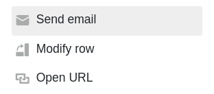
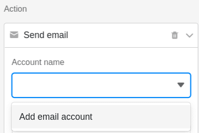
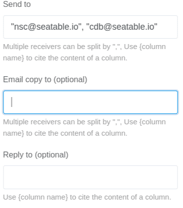
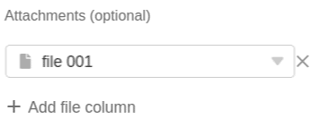
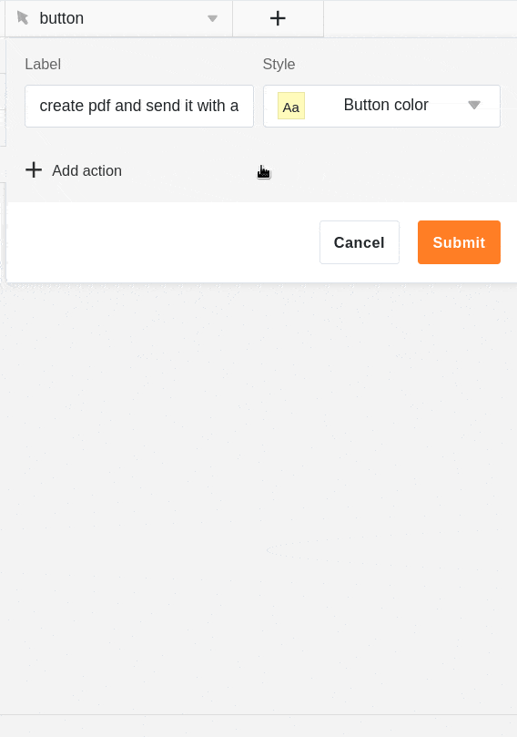

Com a ajuda de um **botão** nas suas filas, pode enviar e-mails a um ou mais destinatários. Tudo o que precisa de fazer é adicionar uma **conta de e-mail** em SeaTable com antecedência.

## Envio de um e-mail por botão

Primeiro, seleccionar a acção **Enviar e-mail** ao criar o [botão]().

Em **Nome da conta**, seleccione uma conta a partir da qual pretende enviar a mensagem de correio electrónico. Se **não vir uma conta** neste campo, tem de [adicionar]() primeiro uma [conta de correio electrónico ao SeaTable]().



Pode encontrar instruções pormenorizadas sobre como configurar a sua **conta de correio electrónico para** enviar mensagens de correio electrónico [aqui](). A **conta** que adicionou estará então disponível para selecção quando criar o botão.



Defina agora o **assunto** e o **conteúdo da** mensagem de correio eletrónico.

Se tiver ativado a barra de texto **formatado**, um duplo clique no campo de texto abre o **editor** familiar no qual pode criar textos mais longos com formatação, listas e imagens. Uma caraterística especial aqui é que também pode **inserir colunas**.

Seleccione o(s) **destinatário** (s) do e-mail. Opcionalmente, pode também seleccionar destinatários que devem receber uma **cópia** do e-mail ou a quem gostaria de **responder** com o e-mail. É possível introduzir múltiplos destinatários separados por vírgulas. Use o nome de uma coluna entre parênteses rectos para citar o conteúdo da coluna.

Opcionalmente, pode acrescentar um **anexo à** mensagem de correio electrónico. Note-se, no entanto, que _não pode_ simplesmente carregar ficheiros, mas deve primeiro guardá-los numa [coluna de ficheiros da]() tabela. No campo **Anexos**, pode então seleccionar uma ou mais **colunas de ficheiros** a partir das quais pretende anexar os ficheiros à mensagem de correio electrónico.

## Execução condicional de acções de múltiplos botões

O [botão]() é um tipo de coluna especial com o qual é possível executar **várias acções simultaneamente** premindo um botão. É possível determinar a **seqüência cronológica de** ações através da execução condicional de uma ação subseqüente. Isto torna possível **alternar acções uma após a outra**.

Por exemplo, pode querer [guardar um documento PDF numa coluna de ficheiros]() com um clique e anexar o ficheiro a uma mensagem de correio electrónico. O problema pode surgir se a mensagem de correio electrónico for enviada antes de o PDF para o anexo ter sido criado.

Para evitar que isso aconteça, pode ligar a execução das acções dos botões a **condições de fil** tragem. No caso de utilização mencionado, por exemplo, pode adicionar como condição de filtro que a mensagem de correio electrónico **só** seja enviada se a **coluna do ficheiro** na mesma linha **não** estiver **vazia.** Desta forma, estabelece-se uma sequência clara: quando o botão é premido, o SeaTable tem de criar primeiro um **PDF**, porque a mensagem de correio electrónico **só** pode ser enviada **com um anexo**.

