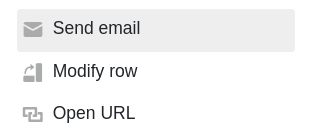
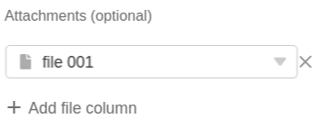

С помощью **кнопки** в вашей строке вы можете отправлять электронные письма одному или нескольким адресатам. Все, что вам нужно сделать, это заранее добавить **учетную запись электронной почты** в SeaTable.

## Отправка сообщения электронной почты с помощью кнопки

Во-первых, при создании [кнопки]() выберите действие **Отправить письмо**.

В поле **Имя учетной записи** выберите учетную запись, с которой вы хотите отправить электронное сообщение. Если вы **не видите учетную запись** в этом поле, вам необходимо сначала [добавить учетную запись электронной почты в SeaTable]().



Подробные инструкции по настройке **учетной записи электронной почты для** отправки писем можно найти [здесь](). Добавленная вами **учетная запись** будет доступна для выбора при создании кнопки.



Теперь определите **тему** и **содержание** письма.

Если вы активировали ползунок **Форматированный текст**, двойной щелчок на текстовом поле открывает привычный **редактор**, в котором можно создавать длинные тексты с форматированием, списки и изображения. Особенностью этого редактора является возможность вставки **колонок**.

Выберите **получателя (получателей** ) сообщения электронной почты. По желанию можно также выбрать адресатов, которые должны получить **копию** письма или которым вы хотите **ответить** письмом. Вы можете ввести несколько получателей, разделенных запятыми. Используйте имя колонки в фигурных скобках для цитирования содержимого колонки.

По желанию вы можете добавить **вложение к** электронному письму. Однако обратите внимание, что вы _не можете_ просто загрузить файлы, а должны сначала сохранить их в [колонке файлов]() таблицы. Затем в поле **"Вложения"** можно выбрать один или несколько **столбцов файлов**, из которых вы хотите прикрепить файлы к электронному письму.

## Условное выполнение нескольких действий с кнопками

[Кнопка]() - это специальный тип столбца, с помощью которого можно выполнять **несколько действий одновременно**, нажимая на кнопку. Вы можете определить **хронологическую последовательность** действий, условно выполнив последующее действие. Это позволяет **переключать действия одно за другим**.

Например, вы можете захотеть [сохранить PDF-документ в колонке файлов]() одним щелчком мыши и прикрепить файл к электронному письму. Проблема может возникнуть в том, что письмо будет отправлено до того, как PDF-файл для вложения будет создан.

Чтобы предотвратить это, можно связать выполнение действий кнопок с **условиями фильтрации**. Например, в упомянутом примере использования вы можете добавить в качестве условия фильтрации, что электронное письмо отправляется **только** в том случае, если **колонка файла** в той же строке **не пуста.** Таким образом, вы устанавливаете четкую последовательность действий: при нажатии кнопки SeaTable сначала должен создать **PDF**, поскольку электронное письмо может быть отправлено **только с вложением**.

