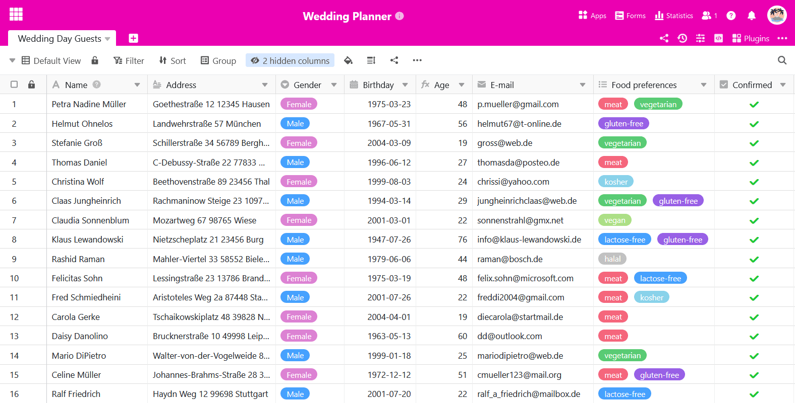

You can use a **button** to **copyrows to other tables**. This is helpful if you need certain data records in different tables but do not want to use [a link](). The following instructions illustrate the use case using an example.

## Application example

You are planning a **wedding reception** and have already drawn up a guest list.

Now you also want to organize the upcoming **hen party** for the bride and the **stag party** for the groom. You therefore want to copy the guests' details into two additional tables once they have confirmed their attendance - depending on the gender of the guest.

## Create suitable tables

Create two new tables for the respective party guest lists.



**Tip:** A simple method to adopt the table structure of the original table is to **duplicate the table without the existing entries**.

In the empty tables, you can of course delete the columns you do not need or add new columns later.

## Create the button

1. Click on the large **plus symbol** at the right-hand end of the table header.
2. Give the column a **name** and select _Button_ as the **column type**.
3. Then define the **label** and **color of the button**.
4. In the next step, define any number of **actions** that should be triggered by activating the button. In our case, select **Copyrow to another table**.

6. Select the **table** into which the rows should be copied.
7. You can set **filters** to link the execution of button actions to **conditions**.
8. Confirm the creation of the button with **Send**.

## Conditional execution of button actions

In our application example, female guests are to be copied to the "Hen Party Guests" table and male guests to the "Stag Party Guests" table when the button is pressed. To do this, you create **the same action twice**, which you equip with opposing **filter conditions**. This allows you to copy the guests to different tables depending on their gender with a single button.



This button action is not supported on [table pages in universal apps](). A corresponding error message appears when the button is pressed.



## Automation as a further option

If you have a SeaTable Enterprise subscription, you can also fully automate this process step. To do this, configure a corresponding [automation with which you can add entries in other tables]().
