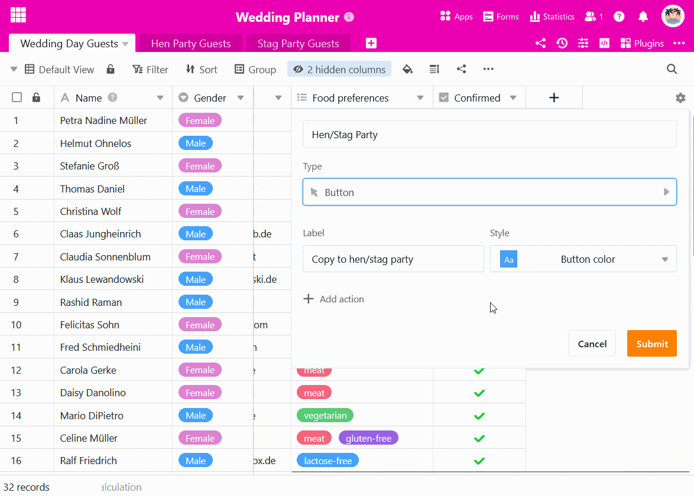

Vous pouvez utiliser un **bouton** pour **copier des lignes dans d'autres tableaux**. C'est utile si vous avez besoin de certains enregistrements dans différents tableaux, mais que vous ne souhaitez pas utiliser de [lien](). Les instructions suivantes illustrent le cas d'utilisation à l'aide d'un exemple.

## Exemple d'application

Vous prévoyez une **fête de mariage** et avez déjà établi une liste d'invités.

Maintenant, vous souhaitez également organiser l'enterrement **de vie de jeune fille** à venir pour la mariée et l'**enterrement de vie de garçon** pour le marié. C'est pourquoi vous souhaitez copier les données des invités après leur confirmation dans deux autres tableaux - en fonction du sexe de l'invité.

## Créer des tableaux appropriés

Créez deux nouveaux tableaux pour les listes d'invités aux fêtes respectives.



**Conseil :** Une méthode simple pour reprendre la structure du tableau d'origine consiste à **dupliquer le tableau sans les entrées existantes**.

Dans les tableaux vides, vous pouvez bien entendu supprimer les colonnes inutiles ou en ajouter de nouvelles ultérieurement.

## Le bouton créer

1. Cliquez sur le grand **symbole "plus"** à l'extrémité droite de l'en-tête du tableau.
2. Donnez un **nom** à la colonne et sélectionnez _Bouton_ comme **type de colonne**.
3. Ensuite, vous définissez le **libellé** et **la couleur du bouton**.
4. Dans l'étape suivante, vous définissez un nombre quelconque d'**actions** qui doivent être déclenchées par l'activation du bouton. Dans notre cas, vous choisissez **Copier la ligne dans un autre tableau**.

6. Sélectionnez le **tableau** dans lequel les lignes doivent être copiées.
7. Vous pouvez définir **des filtres** pour soumettre l'exécution des actions des boutons à des **conditions**.
8. Confirmez la création du bouton en cliquant sur **Envoyer**.

## Exécution conditionnelle des actions des boutons

Dans notre exemple d'application, les invités féminins doivent être copiés dans le tableau "Hen Party Guests" et les invités masculins dans le tableau "Stag Party Guests" lorsqu'on appuie sur un bouton. Pour cela, vous créez **deux fois la même action**, à laquelle vous appliquez des **conditions de filtrage** opposées. Vous pouvez ainsi copier les invités dans des tableaux différents en fonction de leur sexe à l'aide d'un seul bouton.



Cette action de bouton n'est pas supportée sur les [pages de tableau dans les apps universelles](). Si l'on appuie sur le bouton, un message d'erreur correspondant apparaît.



## L'automatisation comme option supplémentaire

Si vous disposez d'un abonnement à SeaTable Enterprise, vous pouvez également automatiser entièrement cette étape du processus. Pour ce faire, configurez une [automatisation]().
