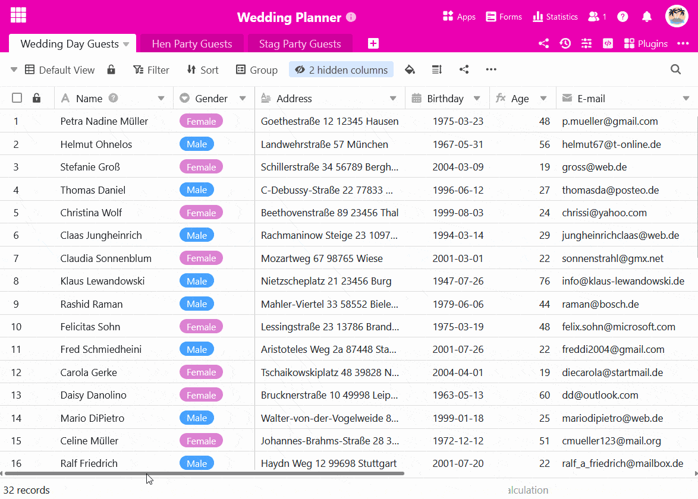
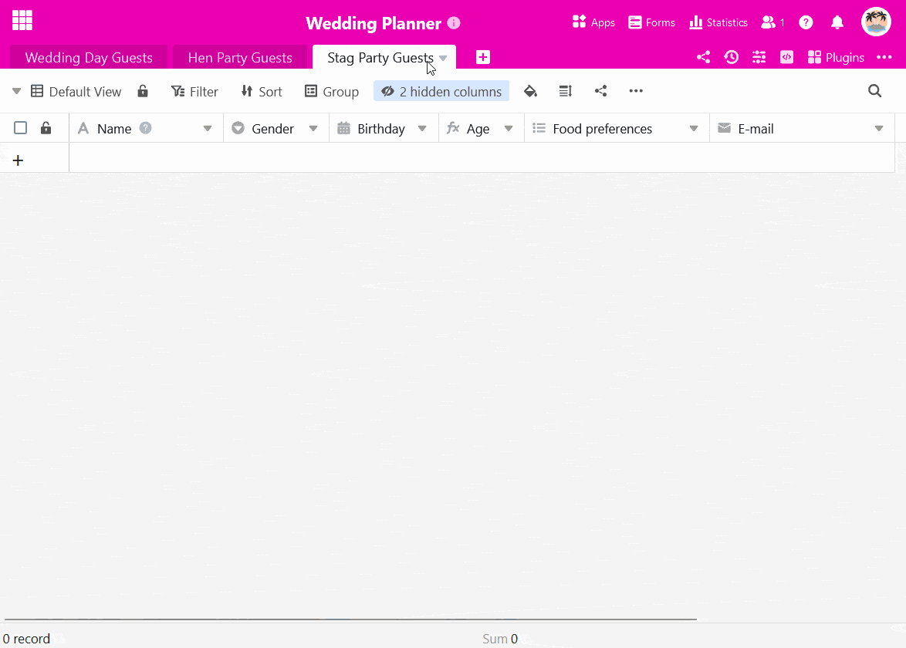

Вы можете использовать **кнопку** для **копирования строк в другие таблицы**. Это удобно, если вам нужны определенные записи данных в разных таблицах, но вы не хотите использовать [ссылку](). Следующие инструкции иллюстрируют этот вариант на примере.

## Пример применения

Вы планируете **свадебный прием** и уже составили список гостей.

Теперь вы также хотите организовать предстоящий **девичник** для невесты и **мальчишник** для жениха. Поэтому вам нужно скопировать данные гостей в две дополнительные таблицы после того, как они подтвердят свое участие, в зависимости от пола гостя.

## Создайте подходящие таблицы

Создайте две новые таблицы для соответствующих списков гостей вечеринки.



**Совет:** Простой способ перенять структуру исходной таблицы - **продублировать таблицу без существующих записей**.

В пустых таблицах вы, конечно, можете удалить ненужные столбцы или добавить новые позднее.

## Создайте кнопку

1. Нажмите на большой **символ плюса** в правом конце заголовка таблицы.
2. Дайте столбцу **имя** и выберите **тип столбца** _Кнопка_.
3. Затем определите **метку** и **цвет кнопки**.
4. На следующем шаге задайте любое количество **действий**, которые будут вызываться при активации кнопки. В нашем случае мы выбрали **Копировать строку в другую таблицу**.

6. Выберите **таблицу**, в которую будут скопированы строки.
7. Вы можете установить **фильтры**, чтобы связать выполнение действий кнопок с **условиями**.
8. Подтвердите создание кнопки нажатием кнопки **Отправить**.

## Условное выполнение действий с кнопками

В примере нашего приложения при нажатии кнопки гости-женщины должны копироваться в таблицу "Гости девичника", а гости-мужчины - в таблицу "Гости мальчишника". Для этого вы **дважды** создаете **одно и то же действие**, которое оснащаете противоположными **условиями фильтрации**. Это позволяет копировать гостей в разные таблицы в зависимости от их пола с помощью одной кнопки.



Это действие кнопки не поддерживается на [страницах таблиц в универсальных приложениях](). При нажатии кнопки появляется соответствующее сообщение об ошибке.



## Автоматизация как дополнительная возможность

Если у вас есть подписка SeaTable Enterprise, вы также можете полностью автоматизировать этот этап процесса. Для этого настройте соответствующую [автоматизацию, с помощью которой вы сможете добавлять записи в другие таблицы]().
