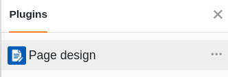
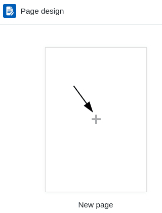
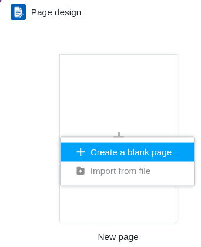
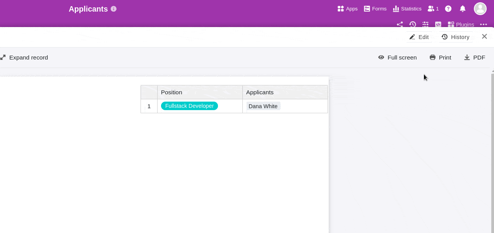
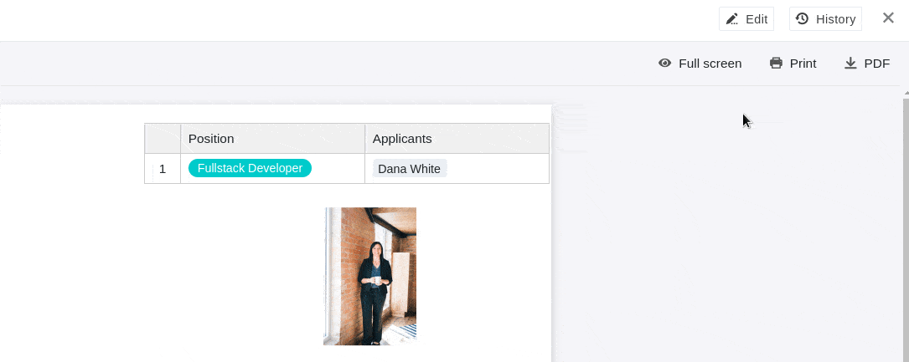
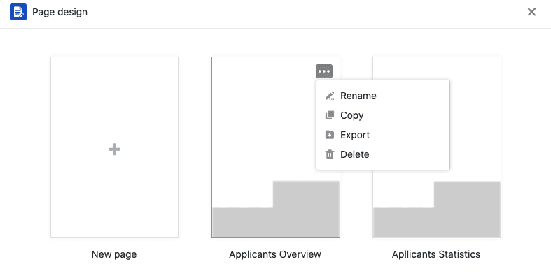

O **plug-in de design da página** oferece-lhe uma vasta gama de opções para visualizar a informação numa tabela sob a forma de cartas de apresentação personalizadas, cartões de visita e boletins informativos, entre outras coisas. Pode utilizar **elementos estáticos** para criar layouts de página que são complementados por **elementos dinâmicos** e **campos de tabela**.

Leia o artigo [Activando um plugin numa base](https://seatable.io/pt/docs/arbeiten-mit-plugins/aktivieren-eines-plugins-in-einer-base/) para saber como activar o plugin de desenho de página e adicioná-lo à sua barra de ferramentas.

## Acrescentar uma nova página

1. Abrir o **plug-in de design da página**.

3. Clique na **nova página com o símbolo "mais"**.

5. Seleccionar a opção **Criar Página em Branco**.

7. Aqui pode encontrar o seguinte **Definições** marca:

    - Seleccione a **tabela** a partir da qual pretende utilizar os dados.
    - Decidir sobre o **tamanho do papel**.
    - Definir a disposição da página para **retrato** ou **paisagem**.

    



## Guardar e editar um modelo

Quando tiver criado uma nova página, pode **guardá-la** como um **modelo** através do botão  **Feito**. Pode editá-lo novamente após clicar no botão  **Editar** no mesmo local.



Ao clicar nos **símbolos de seta**  e  pode desfazer ou refazer passos de edição individuais.

Fora do modo de edição, pode ver e restaurar as **versões** guardadas em  **do** seu modelo.

Utilize o botão  **ecrã inteiro** para mostrar o desenho da página em todo o seu ecrã. Se quiser guardar um documento como PDF no seu dispositivo, clique em  **PDF**, introduza o **nome do ficheiro de exportação** e confirme com **Exportar**.

Clique em  **Imprimir** para imprimir a **entrada actual** ou **todas as entradas da vista**. Assim que confirmar com **Print**, abre-se a janela habitual na qual faz as definições de impressão na sua máquina.

## A visão geral do design da página

Na **visão geral do design da página**, a que se chega através da **seta para trás**  no canto superior esquerdo, é possível ver todos os seus modelos guardados. Se mover o ponteiro do rato sobre um documento e clicar nos **três pontos** que aparecem, abre-se um menu pendente com as opções **Renomear**, **Copiar**, **Exportar** e **Apagar**.



## Elementos laterais

Os **elementos da página** oferecem-lhe a possibilidade de conceber **layouts padronizados**. Tem a escolha entre os seguintes elementos:

- Elementos estáticos
- Elementos dinâmicos
- Campos da tabela
- Ver elementos
- Cabeçalho e rodapé

## Activação dos elementos

Activa-se um elemento ao inserir o respectivo campo na página **usando o arrastar e largar**. Depois, pode também mover o elemento da página clicando e arrastando-o com o rato.

## Selecção e fixação dos elementos

Selecciona-se um elemento inserido na página clicando sobre ele com o **botão direito do rato**. No painel à direita da página verá várias **opções de configuração**, dependendo do elemento seleccionado. Pode saber mais sobre as respectivas opções nos artigos de ajuda ligados para os seguintes elementos.

## Elementos estáticos

Há [imagens estáticas](https://seatable.io/pt/docs/seitendesign-plugin/statisches-bild/) e [textos estáticos](https://seatable.io/pt/docs/seitendesign-plugin/statischer-text/). Para estes elementos, é necessário introduzir **manualmente** textos ou imagens. A informação dos elementos permanece a mesma, mesmo que as entradas da tabela mudem.

## Elementos dinâmicos

Os [elementos dinâmicos](https://seatable.io/pt/docs/seitendesign-plugin/dynamische-elemente/) mudam com base em determinados critérios, mas independentemente das entradas na tabela. Estes campos são **pré-preenchidos** e ajustam **automaticamente** o seu conteúdo. Há três elementos dinâmicos: **Data Actual**, **Nome do Modelo** e **Utilizador Actual**.

## Campos da tabela

Como [campos da tabela](https://seatable.io/pt/docs/seitendesign-plugin/tabellenfelder/), o plug-in de design da página lista **todas as colunas da tabela** a partir das quais se podem incluir dados na página. O conteúdo dos campos depende das linhas da tabela e muda em função da entrada.

## Ver elementos

Também tem dois **elementos de visualização** à sua escolha. O elemento **All View Entries** permite incorporar na página toda a secção da tabela definida sob a vista. O **nome da vista** contém apenas o nome da vista seleccionada.

## Cabeçalho e rodapé

Além disso, pode adicionar [cabeçalhos e rodapés](https://seatable.io/pt/docs/seitendesign-plugin/kopf-und-fusszeile/) às suas páginas. Nestas áreas de página pode incorporar elementos estáticos e dinâmicos, tais como o **número de página**.
