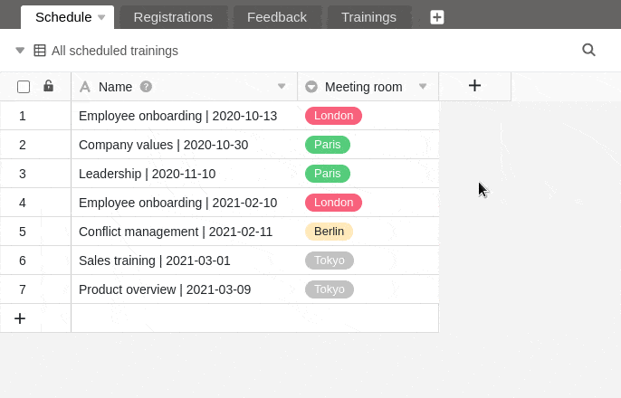

En SeaTable, tiene la opción de añadir **columnas de casillas de** verificación a sus tablas. Son ideales para marcar tareas como completadas, por ejemplo, es decir, para tener una visión general de si las filas cumplen una determinada **condición de sí/no**. Por lo tanto, puede hacer un uso excelente de las columnas de casillas de verificación para [filtrar](https://seatable.io/es/docs/ansichtsoptionen/filtern-von-eintraegen-in-einer-ansicht/), [ordenar](https://seatable.io/es/docs/ansichtsoptionen/sortieren-von-eintraegen-in-einer-ansicht/) o [agrupar](https://seatable.io/es/docs/ansichtsoptionen/gruppieren-von-eintraegen-in-einer-ansicht/).

## Crear una columna de casillas de verificación

1. Haga clic en el **símbolo \[+\] situado** a la derecha de la última columna de cualquier tabla.
2. Dale un **nombre** a la columna.
3. Seleccione **Checkbox** como tipo de columna.
4. Decida si el [valor por defecto]() de la columna debe estar **vacío** o **marcado**.
5. Confirme con **Enviar**.

## Opciones de estilo de una columna de casillas de verificación

¿No te gusta el **tick verde** por defecto? No hay problema. Tienes 70 opciones de estilo diferentes para rellenar tus casillas de verificación como quieras.

