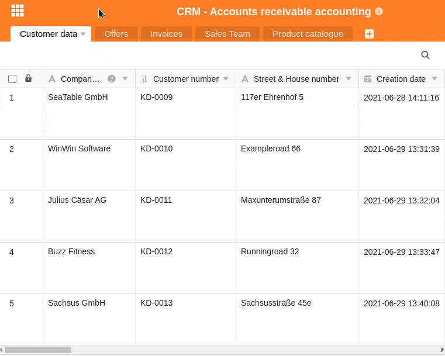
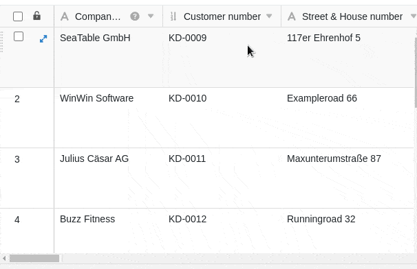

Si has llenado gradualmente tus tablas con un gran número de columnas nuevas, llegará un momento en que ya no será posible echar un vistazo a todas las columnas de la tabla sin tener que desplazarse hacia la derecha. SeaTable le permite **fijar una o varias columnas**, que permanecerán en su posición independientemente del desplazamiento.

Fijando la(s) primera(s) columna(s), podrá seguir **leyendo** sus **datos** **después de desplazarse**. Esta función es muy útil cuando se desea visualizar o comparar valores de una de las columnas anteriores con los de las columnas posteriores conjuntamente.

Las columnas fijas se aplican siempre a toda la tabla, incluidas todas las vistas.

## Ajustar el número de columnas fijas

1. Mueva el ratón sobre la **línea divisoria** entre las dos primeras columnas hasta que aparezca el símbolo de una mano en lugar del puntero del ratón con la instrucción **Ajuste el número de columnas fijas arrastrando**.
2. **Arrastre** el **cursor** hasta el final de la última **columna** que desea fijar.



## Fijación de la primera columna

Además de la forma descrita anteriormente, hay **otra manera** de fijar columnas. Sin embargo, esta opción sólo está disponible para la **primera columna de** cada tabla. Por consiguiente, si selecciona esta opción, **sólo** se fijará la primera columna de la tabla.

1. Haga clic en el **símbolo** triangular **desplegable** de la derecha en la cabecera de la tabla de la primera columna.
2. Haga clic en **Fijar Columna**.


