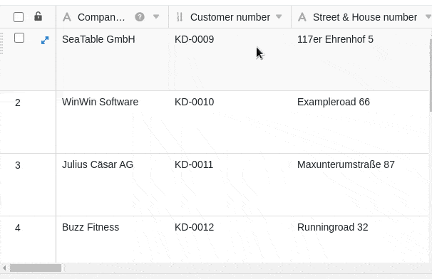

Se tiver enchido gradualmente as suas tabelas com um grande número de novas colunas, a certa altura já não será possível vigiar todas as colunas das tabelas sem ter de se deslocar para a direita. O SeaTable permite-lhe, portanto, **fixar uma ou mais colunas**, que depois permanecem na sua posição independentemente da rolagem.

Ao fixar a(s) primeira(s) coluna(s), ainda se pode **ler** os seus **dados** **após a rolagem**. Esta função é muito útil quando se pretende visualizar ou comparar valores de uma das colunas da frente com os das colunas de trás em conjunto.

As colunas fixas aplicam-se sempre a toda a tabela incluindo todas as vistas.

## Ajustar o número de colunas fixas

1. Mova o rato sobre a **linha divisória** entre as duas primeiras colunas até aparecer um símbolo de mão em vez do ponteiro do rato com a instrução **Ajustar o número de colunas fixas arrastando**.
2. **Arraste** o **cursor** para o fim da última **coluna** que pretende corrigir.



## Fixação da primeira coluna

Para além da forma acima descrita, existe **outra forma** de fixar colunas. No entanto, esta opção só está disponível para a **primeira coluna de** cada tabela. Consequentemente, se seleccionar esta opção, **apenas** a primeira coluna da tabela será fixada.

1. Clique no **símbolo** triangular **suspenso** à direita no cabeçalho da tabela da primeira coluna.
2. Clique em **Fix Column**.


