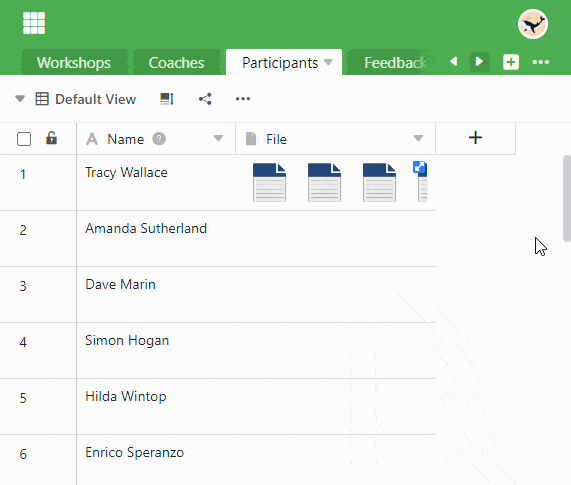

SeaTable позволяет **удалять** **файлы** и **изображения** разными способами. Следующие инструкции относятся как к [столбцам](), так и к [столбцам файлов](https://seatable.io/ru/docs/dateien-und-bilder/die-datei-spalte/).

## Удаление файлов и изображений через сведения о строке

1. Откройте детальный вид ряда, нажав на **символ двойной стрелки**, который появляется при наведении курсора мыши на нумерацию ряда.
2. В окне **Сведения о строке** наведите курсор мыши на **изображение** или **файл**, который вы хотите удалить.
3. В правом верхнем углу миниатюры появится . Нажмите на него.
4. Откроется диалог с вопросом **Действительно ли вы хотите удалить этот файл/изображение?** Если да, нажмите кнопку **Удалить**.

## Удалить через ячейку

1. Откройте окно **Все изображения** или **Все файлы**, **дважды щелкнув** по **ячейке** в столбце изображений или файлов.
2. Для изображений удаление происходит так же, как и через детали строки. Для файлов у вас есть следующие возможности:
    - Нажмите кнопку **Выбрать** и выберите все файлы, которые вы хотите удалить. Подтвердите выбор кнопкой **Удалить**.
    - Наведите указатель мыши на файл и нажмите на **значок с тремя точками**, чтобы выбрать опцию **Удалить**.


