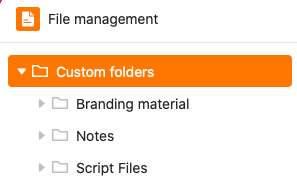
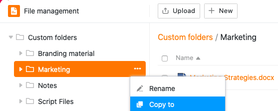
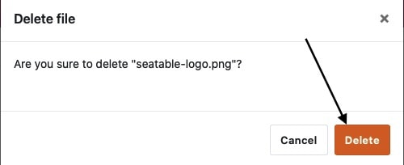

Die **Dateiverwaltung** revolutioniert den Umgang mit Dateien in Ihrer Base. Sie können **Dateien** dort direkt hochladen, umbenennen, kopieren, verschieben, herunterladen und löschen. Sogar **neue Dokumente** (z. B. Excel-, Word- oder PowerPoint-Dateien) können Sie dort erstellen und über den integrierten Editor bearbeiten.

In diesem Übersichtsartikel finden Sie alle Informationen zum Aufbau und zu den einzelnen Funktionen der Dateiverwaltung.

## Die Dateiverwaltung in der Übersicht

In der Dateiverwaltung befinden sich verschiedene Ordner, die wiederum verschiedene Dateien enthalten. Grundsätzlich lässt sich zwischen **drei Ordner-Typen** unterscheiden:

- **Eigene Ordner** sind von der Struktur einer Base unabhängig und können vom Benutzer frei erstellt und organisiert werden.
  - **Systemordner** werden automatisch von SeaTable erstellt, wenn Sie bestimmte Spalten, Apps oder Webformulare anlegen. Sie enthalten [Dateien]().
  - In einem **Seafile Ordner** befinden sich alle Dateien, die Sie zuvor in den gleichnamigen externen Cloudspeicher hochgeladen haben. Wie genau die Integration von Seafile Bibliotheken funktioniert und welche Vorteile sie mit sich bringt, erfahren Sie [hier](https://seatable.io/docs/integrationen-innerhalb-von-seatable/eine-seafile-bibliothek-an-seatable-anbinden/).
  

Das folgende Schaubild zeigt die komplette **Ordnerstruktur der Dateiverwaltung** in der Übersicht:

## Auf die Dateiverwaltung zugreifen

1. Öffnen Sie eine **Base**, in der Sie Dateien verwalten möchten.
2. Klicken Sie auf die drei Punkte im Base-Header, um die **erweiterten Base-Optionen** zu öffnen.
3. Gehen Sie auf **Dateiverwaltung**.
   5. Im Anschluss öffnet sich automatisch ein größenverstellbares Fenster mit der **Ordnerstruktur** – die Dateiverwaltung der Base.
   

Mit einem Klick auf das **mittlere Symbol** am oberen rechten Rand des Fensters können Sie die Dateiverwaltung auch **der Toolbar hinzufügen**.

So können Sie die **Dateiverwaltung** stets mit nur einem Klick von Ihrer Werkzeugleiste aus erreichen.

Wenn Sie die Dateiverwaltung wieder aus Ihrer Toolbar **entfernen** möchten, klicken Sie einfach erneut auf das Symbol am Fensterrand.

## Fenstergröße und Position der Dateiverwaltung anpassen

Damit Sie Ihre Tabellen und Daten auch während der Verwaltung Ihrer Dateien im Blick haben und [Dateien aus der Dateiverwaltung direkt in die passenden Spalten Ihrer Tabellen ziehen](https://seatable.io/?post_type=docs&p=26594#8-toc-title) können, haben Sie die Möglichkeit, die Fenstergröße der Dateiverwaltung anzupassen.

Öffnen Sie hierzu einfach die Dateiverwaltung und fahren Sie mit dem Mauszeiger über die **zwei Striche** am oberen Rand des Fensters, bis ein **Doppelpfeil** erscheint. Ziehen Sie das Fenster im Anschluss mit gedrückter Maustaste zur gewünschten Position und lassen Sie los, sobald diese erreicht ist.

Zusätzlich zur Anpassung der Fenstergröße haben Sie auch die Möglichkeit, die Dateiverwaltung **am rechten Seitenrand anzuheften**. Klicken Sie dazu am oberen rechten Rand auf das **erste Symbol von links**.

Die Dateiverwaltung erscheint anschließend in einem Fenster am rechten Seitenrand.

Auf dem gleichen Weg können Sie die Dateiverwaltung wieder an den unteren Rand anheften.

## Die verschiedenen Funktionen der Dateiverwaltung im Detail

Innerhalb der Dateiverwaltung stehen Ihnen diverse Verwaltungsmöglichkeiten zur Verfügung.

### Eine neue Datei in der Dateiverwaltung erstellen

Sie können mit nur wenigen Klicks neue Dateien direkt in der Dateiverwaltung erstellen und bearbeiten. Klicken Sie dazu zunächst auf **Neu** und wählen Sie anschließend entweder die Option **Neue Datei** oder direkt die verschiedenen zur Auswahl stehenden **Dateitypen**.

Die neu erstellte Datei erscheint anschließend im entsprechenden **eigenen Ordner**. Klicken Sie auf den Dateinamen, um die Datei im Editor zu öffnen und zu bearbeiten.

### Einen eigenen Ordner in der Dateiverwaltung erstellen

Neben Dateien können Sie auch **eigene Ordner** direkt in der Dateiverwaltung erstellen. Klicken Sie dazu im Bereich **Eigene Ordner** auf **Neu** und wählen Sie anschließend die Option **Neuer Ordner**.

Der neu erstellte Ordner wird im Anschluss zur Navigation im Bereich **Eigene Ordner** hinzugefügt.

### Dateien und Ordner in die Dateiverwaltung hochladen

Auf Ihrem Gerät gespeicherte Dateien können Sie ebenfalls mit nur wenigen Klicks in die Dateiverwaltung hochladen. Klicken Sie dafür zunächst auf **Hochladen** und wählen Sie im Anschluss die Option **Dateien hochladen**.

In der Dateiverwaltung hochgeladene Dateien werden stets in den **Eigenen Ordnern** gespeichert. Zusätzlich öffnet sich ein Upload-Fenster, das bei größeren Datenmengen den Fortschritt anzeigt und in dem Sie den Upload ggf. abbrechen oder erneut durchführen können.

Kongruent zum Hochladen von Dateien haben Sie zudem die Möglichkeit, **ganze Ordner** mit Dateien in die Dateiverwaltung hochzuladen.

Hochgeladene Ordner werden immer automatisch den **Eigenen Ordnern** hinzugefügt.



### Dateien per Drag-and-Drop in passende Tabellenspalten verschieben

Eine weitere nützliche Funktion der Dateiverwaltung ist das bequeme **Verschieben von Dateien**. Per **Drag-and-Drop** können Sie Dateien nicht nur in die Dateiverwaltung hineinziehen, sondern auch aus der Dateiverwaltung in Datei-Spalten der Tabelle einfügen.



### Eine Datei oder einen Ordner umbenennen



Sowohl Dateien als auch Ordner im Bereich **Eigene Ordner** können Sie mit nur wenigen Klicks **umbenennen**. Fahren Sie dazu einfach mit der Maus über eine Datei oder einen Ordner, klicken Sie auf die erscheinenden **drei Punkte** und wählen Sie **Umbenennen** aus.

Anschließend geben Sie den neuen **Namen** der Datei bzw. des Ordners in das **Textfeld** ein und bestätigen ihn mit der **Enter-Taste**.

### Eine Datei in einen Ordner kopieren



Eine Datei kann mit nur wenigen Klicks in einen eigenen Ordner kopiert werden. Die kopierte Datei ist im Anschluss sowohl im Ursprungsordner als auch im Zielordner vorhanden.

Fahren Sie dazu einfach mit der Maus über eine Datei, klicken Sie auf die erscheinenden **drei Punkte** und wählen Sie **Kopieren zu** aus.

Wählen Sie anschließend den **Zielordner** aus und bestätigen Sie mit **Abschicken**.

### Einen eigenen Ordner in einen anderen Ordner kopieren



Kongruent zum Kopieren von Dateien können auch eigene Ordner mit nur wenigen Klicks in einen anderen Ordner kopiert werden. Der kopierte Ordner ist im Anschluss sowohl am Ursprungsort als auch am Zielort vorhanden.

Fahren Sie dazu einfach mit der Maus über einen eigenen Ordner, klicken Sie auf die erscheinenden **drei Punkte** und wählen Sie **Kopieren zu** aus.

Wählen Sie anschließend den **Zielordner** aus und bestätigen Sie mit **Abschicken**.

### Dateien in einen Ordner verschieben



Eine Datei kann mit nur wenigen Klicks in einen eigenen Ordner verschoben werden. Die verschobene Datei ist im Anschluss **nicht** mehr im Ursprungsordner, sondern **nur noch im Zielordner** vorhanden.

Fahren Sie dazu einfach mit der Maus über eine Datei, klicken Sie auf die erscheinenden **drei Punkte** und wählen Sie **Ansicht verschieben** aus.

Wählen Sie anschließend den **Zielordner** aus und bestätigen Sie mit **Abschicken**.

### Einen eigenen Ordner in einen anderen Ordner verschieben



Kongruent zum Verschieben von Dateien können auch Ordner in der Dateiverwaltung mit nur wenigen Klicks in einen anderen Ordner verschoben werden. Der verschobene Ordner ist im Anschluss **nicht** mehr am Ursprungsort, sondern **nur noch im Zielordner** vorhanden.

Fahren Sie dazu einfach mit der Maus über einen Ordner, klicken Sie auf die **drei Punkte** und wählen Sie **Ansicht verschieben** aus.

Wählen Sie anschließend den **Zielordner** aus und bestätigen Sie mit **Abschicken**.



### Dateien herunterladen

Alle Dateien können Sie jederzeit mit nur wenigen Klicks aus der Dateiverwaltung **herunterladen**. Nutzen Sie diese Funktion, um wichtige Dateien auf Ihrem Gerät zu sichern.

Fahren Sie mit der Maus über eine Datei und klicken Sie auf das **Download-Symbol** . Die ausgewählte Datei wird im Anschluss automatisch auf Ihrem Gerät gespeichert.

### Dateien löschen und wiederherstellen

Sie können jede beliebige Datei mit nur wenigen Klicks aus der Dateiverwaltung **löschen**. Fahren Sie dazu einfach mit der Maus über eine Datei und klicken Sie auf das **Papierkorb-Symbol**.

Bestätigen Sie im Anschluss den Vorgang nochmals mit **Löschen**.

Dateien, die Sie aus der Dateiverwaltung löschen, verschwinden auch aus Ihrer Base (z. B. aus Signatur-, Datei-, Bild-Spalten, Webformularen oder Universal Apps) und landen im **Papierkorb**, wo sie für 60 Tage verbleiben.



Wenn Sie eine Datei aus dem Papierkorb wiederherstellen möchten, beispielsweise weil sie aus Versehen gelöscht wurde, klicken Sie auf **Wiederherstellen**. Die Datei finden Sie anschließend in dem Ordner, wo sie vor der Löschung war. Wenn Sie den **Papierkorb leeren**, gehen alle gelöschten Dateien und Ordner endgültig verloren.

### Ordner löschen und wiederherstellen

**Eigene Ordner** in der Dateiverwaltung können Sie jederzeit mit nur wenigen Klicks wieder löschen. Fahren Sie hierzu in der **Navigation** mit der Maus über einen beliebigen Ordner, klicken Sie auf die erscheinenden **drei Punkte** und wählen Sie Option **Löschen**.

Bestätigen Sie die Löschung im Anschluss mit **Löschen**.



Generell können Sie **Unterordner** aber auch auf einem anderen Weg löschen. Klicken Sie dazu zunächst auf den Ordner, in dem sich der zu löschende Ordner befindet. Sie erhalten nun eine Übersicht mit allen Ordnern und Dateien, die sich im ausgewählten Ordner befinden. Fahren Sie hier mit der Maus über den zu löschenden Ordner und klicken Sie auf das **Papierkorb-Symbol**.

Bestätigen Sie den Vorgang mit **Löschen**.

Ordner, die Sie aus der Dateiverwaltung löschen, landen im **Papierkorb**, wo sie für 60 Tage verbleiben.

{{< warning  type="warning" headline="Wichtige Hinweise"  text="Bitte beachten Sie, dass bei der Löschung von Ordnern **alle Dateien**, die sich in den jeweiligen Ordnern befinden, ebenfalls **gelöscht** werden. Selbiges gilt für die Unterordner, die sich in einem gelöschten Ordner befinden. Die gelöschten Dateien werden folglich auch aus Ihrer Base (z.B. aus Signatur-, Datei-, Bild-Spalten, Webformularen oder Universal Apps) verschwinden. Stellen Sie sicher, dass Sie **ausschließlich** Ordner mit nicht mehr benötigten Dateien aus der Dateiverwaltung löschen. Nach **60 Tagen** im Papierkorb werden sowohl Ordner als auch Dateien endgültig aus dem System entfernt." />}}

Wenn Sie einen Ordner aus dem Papierkorb wiederherstellen möchten, beispielsweise weil Sie ihn aus Versehen gelöscht haben, klicken Sie auf **Wiederherstellen**. Der Ordner erscheint anschließend an der Stelle, wo er vor der Löschung war. Wenn Sie den **Papierkorb leeren**, gehen alle gelöschten Dateien und Ordner endgültig verloren.

