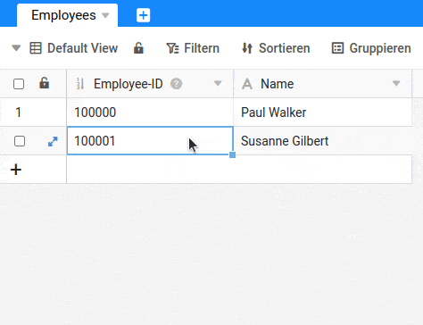
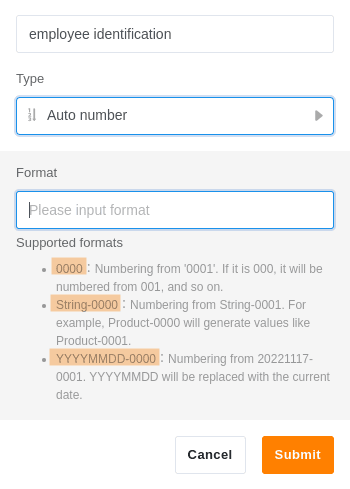

El tipo de columna **Número automático** genera un número creciente automáticamente para cada nueva fila. Este tipo de columna se utiliza cuando se necesita un identificador único para cada registro.

Tenga en cuenta que esta columna _no_ sirve para contar el número de registros de una tabla. Si [elimina una fila](), los registros restantes _no_ se vuelven a numerar. Esto puede dar lugar a **lagunas** en la numeración.

Para **volver a numerar** los registros (por ejemplo, para eliminar huecos), puede eliminar la columna Número _automático_ y volver a crearla, o cambiar el tipo de columna y convertirla de nuevo en _Número automático_.

## Hay tres formatos disponibles

Al crear la columna _Número automático_, se determina el **formato** que deben tener los valores de esta columna. Puede elegir un **número** con un determinado número de dígitos y anteponer a este número una **cadena de** letras o dígitos (por ejemplo, la **fecha** actual).

## Preguntas frecuentes

Aunque el tipo de columna _Número automático_ parece relativamente sencillo, hay algunas características especiales que deben tenerse en cuenta.

Sí. En las opciones de la columna, ésta ofrece la posibilidad de **restablecer** el **número automático** a un valor determinado, que luego recibe la fila siguiente.

Sí, esto puede ocurrir. Si restablece el número automático, los valores también pueden producirse dos veces. Por lo tanto, los valores de esta columna no son únicos.

Sí. Si utiliza una suscripción Plus o Enterprise de SeaTable, puede **bloquear la columna para editarla**. De este modo, nadie puede restablecer el número y cada valor sigue siendo único.


