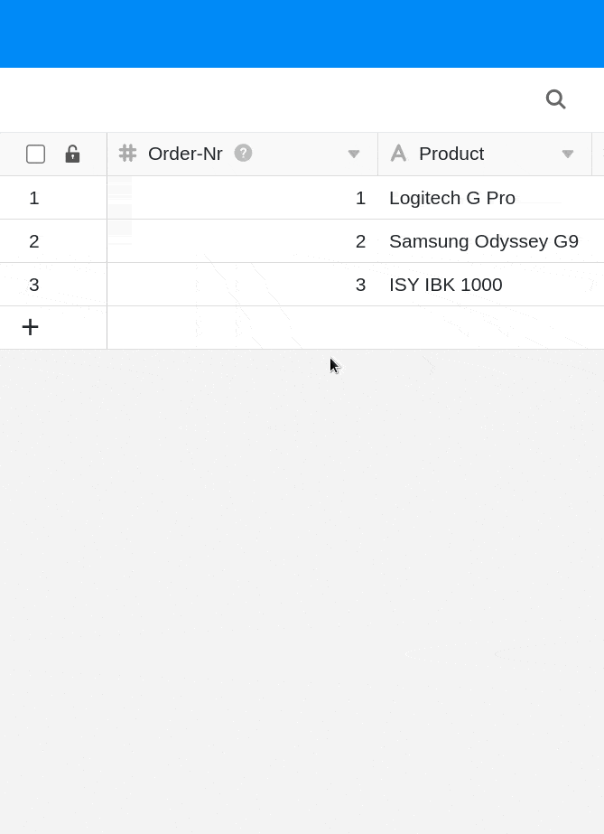
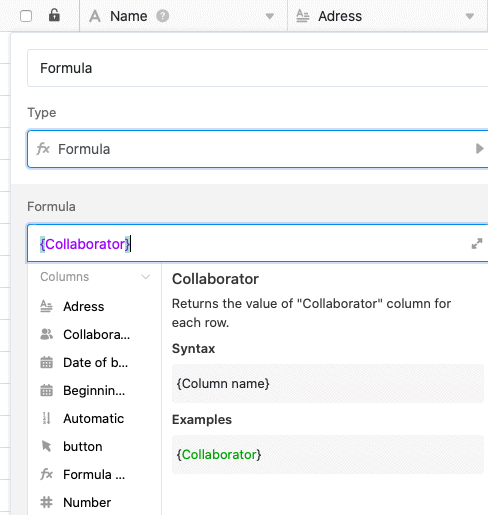

A **primeira coluna** de uma tabela no SeaTable tem várias características e restrições especiais em comparação com as outras colunas. Aqui pode descobrir como personalizar a primeira coluna no SeaTable.

## As características especiais da primeira coluna em SeaTable

- Ao contrário das outras colunas, **não é possível ocultar** a primeira coluna de uma tabela.
- Ao contrário das outras colunas, **não é possível deslocar** a primeira coluna de uma tabela.
- Ao contrário das outras colunas, **não é possível eliminar** a primeira coluna de uma tabela.
- No entanto, ao contrário das outras colunas, é possível **fixar** a primeira coluna individualmente.
- A primeira coluna suporta apenas os **tipos de coluna** [texto](die-datum-spalte/), [selecção única](https://seatable.io/pt/docs/auswahlspalten/anlegen-einer-einfachauswahl-spalte/), [número automático](https://seatable.io/pt/docs/text-und-zahlen/der-spaltentyp-automatische-nummer/) e [fórmula](https://seatable.io/pt/docs/formeln/grundlagen-von-seatable-formeln/).

## Como personalizar o tipo da primeira coluna

1. Clique no **símbolo** triangular **suspenso** à direita do nome da primeira coluna.
2. Ir para **Personalizar tipo de coluna**.
3. Clique no **campo do** tipo de coluna actual.
4. Seleccionar um **novo tipo de coluna** para a primeira coluna.
5. Fazer **configurações de formato**, se necessário.
6. Clique em **Submeter**.
7. Confirmar o ajustamento clicando em **Convert**.

Para a **primeira coluna**, existem apenas **seis tipos de colunas** à escolha:

- [Texto](https://seatable.io/pt/docs/text-und-zahlen/die-spalten-text-und-formatierter-text/)
- [Número](https://seatable.io/pt/docs/text-und-zahlen/die-zahlen-spalte/)
- [Data](die-datum-spalte/)
- [Selecção única](https://seatable.io/pt/docs/auswahlspalten/anlegen-einer-einfachauswahl-spalte/)
- [Número automático](https://seatable.io/pt/docs/text-und-zahlen/der-spaltentyp-automatische-nummer/)
- [Fórmula](https://seatable.io/pt/docs/formeln/grundlagen-von-seatable-formeln/)

## Fórmulas na primeira coluna

Se definir uma **fórmula** como a **primeira coluna** de uma tabela, pode utilizar a fórmula simples **{nome da coluna}**, por exemplo, para **citar** as entradas de quase todas as outras colunas da sua tabela. Isto funciona mesmo que o outro tipo de coluna **não** seja suportado na primeira coluna.

## Perguntas mais frequentes



Quais são as limitações da primeira coluna?|||

A primeira coluna não pode ser **escondida**, nem **deslocada** ou **apagada**.

---

É possível mudar depois o tipo da primeira coluna?|||

Sim, isto é possível. Em alguns casos, contudo, pode acontecer que a informação **se perca** quando se [muda o tipo de coluna](), por exemplo, de texto para número. Por conseguinte, após uma conversão, verificar se toda a informação foi transferida correcta e completamente.

---

O que é um número automático?|||

Se pretender que as suas linhas tenham um **número de identificação único**, o tipo de coluna [Número automático](https://seatable.io/pt/docs/text-und-zahlen/der-spaltentyp-automatische-nummer/) pode ser-lhe útil. Os exemplos incluem números de facturas, casos de teste ou IDs de empregados. O número também pode ser complementado com qualquer prefixo.


