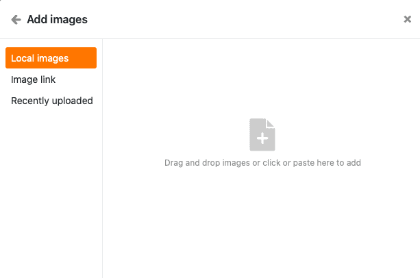
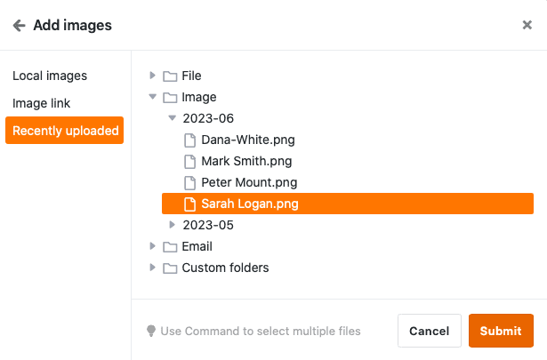
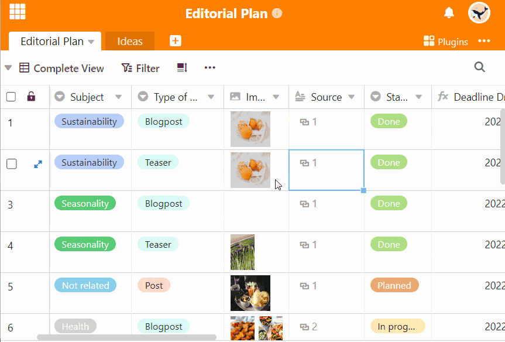
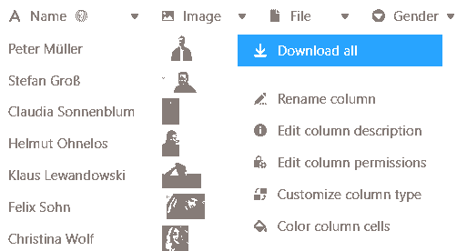
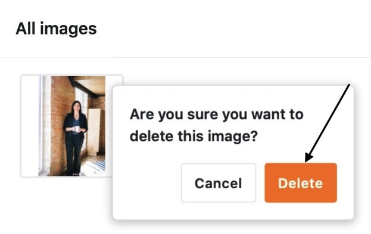

Mithilfe einer **Bild-Spalte** können Sie mit nur wenigen Klicks neue Bilder in Ihren Tabellen hochladen, speichern und verwalten.

## Wie Sie eine Bild-Spalte anlegen

1. Klicken Sie rechts neben der letzten Spalte Ihrer Tabelle auf das **\[+\]-Symbol**.
2. Geben Sie der Spalte im oberen Feld einen **Namen**.
3. Wählen Sie aus dem Drop-down-Menü den Spaltentyp **Bild** aus.
4. Bestätigen Sie mit **Abschicken**.

## Hinzufügen von Bildern

In einer Bild-Spalte stehen Ihnen verschiedene Möglichkeiten zum **Hinzufügen** von Bildern zur Verfügung. So geht's:

1. Klicken Sie in die **Zelle** einer Bild-Spalte.
2. Klicken Sie auf das erschienene **Plus-Symbol**.
3. Ein neues Fenster öffnet sich. Hier können Sie **Bilder von Ihrem Gerät** hochladen, per **URL** einbinden oder aus der [Dateiverwaltung](https://seatable.io/docs/dateien-und-bilder/das-dateimanagement-einer-base/) hinzufügen.

### Lokale Bilder

Im Bereich **Lokale Bilder** können Sie in das Feld mit dem Dokumente-hinzufügen-Symbol klicken, eine oder mehrere **Bilddateien auf Ihrem Gerät** auswählen und diese in die Bild-Spalte hochladen.



### Bild-Link

Im Bereich **Bild-Link** können Sie Bilder durch die Eingabe der **Bild-URL** zur Bild-Spalte hinzufügen. Fügen Sie dazu die URL in das freie Feld ein und klicken Sie auf das **Link-Symbol** .



### Zuletzt hochgeladen

Im Bereich **Zuletzt hochgeladen** haben Sie Zugriff auf die [Dateiverwaltung](https://seatable.io/docs/dateien-und-bilder/das-dateimanagement-einer-base/) der Base. Dort sind Bilder gespeichert, die Sie bereits in **Bild-** oder **Datei-Spalten** oder in **eigene Ordner** hochgeladen haben. Wählen Sie ein Bild aus und fügen Sie es mit **Abschicken** in die Bild-Spalte ein.

### Per Drag-and-Drop

Darüber hinaus können Sie Bilder auch **direkt in eine Tabelle einfügen**. Markieren Sie dazu beliebig viele **Bilder auf Ihrem Gerät** und ziehen Sie sie mit gedrückter Maustaste in die **Zelle** einer Bild-Spalte.

## Vorschau von Bilddateien

Sobald Sie eine Bilddatei in die **Bild-Spalte** einfügen, wird Ihnen das hochgeladene Bild als **verkleinertes Vorschaubild** angezeigt. Diese **Miniatur** können Sie durch einen **Doppelklick** auf das dargestellte Bild **vergrößern**.

Im **Vollbildmodus** können Sie die Bilder mithilfe der **Lupen** vergrößern und verkleinern sowie mithilfe der **Pfeile** zwischen mehreren Bildern in einer Zeile oder Spalte wechseln. Außerdem können Sie über die Icons  und  die angezeigte Bilddatei **löschen** oder **downloaden**.

## Verwaltung von Bildern

Neben dem Upload von Bildern stehen Ihnen in einer Bild-Spalte auch verschiedene Möglichkeiten zur Verwaltung Ihrer Bilder zur Verfügung.

### Bilder herunterladen

Sie können Bilder, die in einer Bild-Spalte gespeichert sind, mit nur wenigen Klicks **herunterladen**. Klicken Sie hierzu zunächst mit einem **Doppelklick** in eine Zelle, die bereits Bilder enthält, _oder_ auf das **blaue Doppelpfeil-Symbol**.

Wählen Sie anschließend das gewünschte **Bild** aus und klicken Sie auf das **Download-Icon**  im Bild.

Wenn Sie **alle Bilder in einer Spalte** herunterladen möchten, öffnen Sie das Drop-down-Menü über den Spaltenkopf und wählen **Alle herunterladen** aus.

Anschließend können Sie noch einen **eigenen Dateinamen** festlegen und bekommen angezeigt, **wie viele Dateien** im Export enthalten sein werden.

Wenn Sie die **drei Punkte** anklicken, haben Sie zwei Optionen, um die Datei zu speichern: Bei einem **Download** wird eine Zip-Datei auf Ihrem Gerät gespeichert, aus der Sie alle Bilder extrahieren können. Außerdem können Sie die Bilder auch **in Seafile speichern**. Dazu müssen Sie zuvor [eine Seafile-Bibliothek an Ihre Base anbinden](https://seatable.io/docs/integrationen-innerhalb-von-seatable/eine-seafile-bibliothek-an-seatable-anbinden/).

### Bilder löschen

Alle Bilder, die in einer Bild-Spalte gespeichert sind, können Sie zudem auch wieder **löschen**. Klicken Sie hierzu zunächst mit einem **Doppelklick** in eine Zelle, die bereits Bilder enthält, _oder_ auf das **blaue Doppelpfeil-Symbol**.

Wählen Sie anschließend das gewünschte **Bild** aus und klicken Sie auf das  **-Symbol**. Bestätigen Sie den Vorgang im Anschluss mit **Löschen**.


