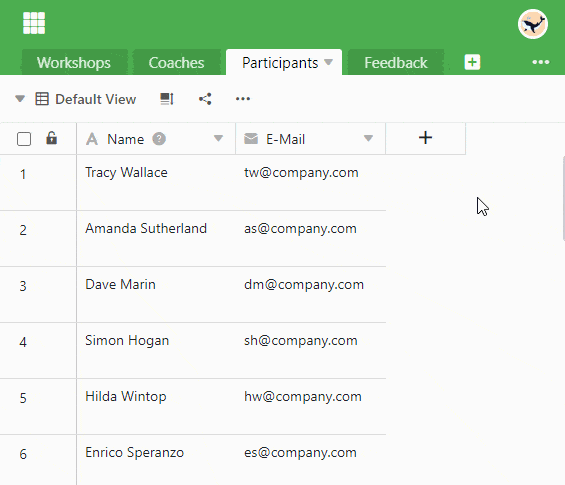
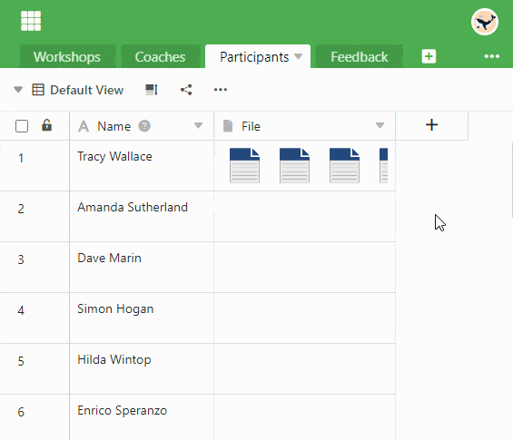
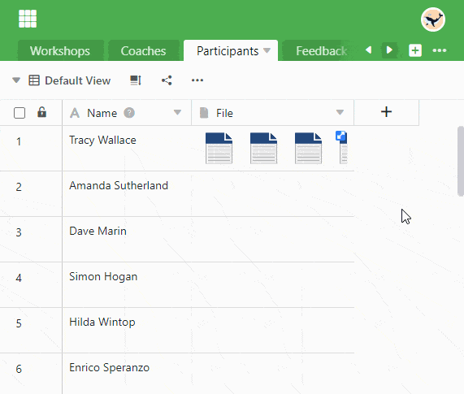

In einer **Datei-Spalte** können Sie eine oder mehrere Dateien speichern und so die jeweilige Zeile um Dokumente ergänzen.

## Wie Sie eine Datei-Spalte anlegen

1. Klicken Sie rechts neben der letzten Spalte Ihrer Tabelle auf das **\[+\]-Symbol**.
2. Geben Sie der Spalte im oberen Feld einen **Namen**.
3. Wählen Sie aus dem Drop-down-Menü den Spaltentyp **Datei** aus.

## Hochladen von neuen Dateien

Sie können in der Datei-Spalte **Dateien hochladen**, indem Sie mit der Maus auf eine **Zelle** klicken und das erschienene **Plus-Symbol** anwählen. In das neu geöffnete Fenster können Sie **per Drag-and-Drop** Dateien hineinziehen oder mit der Maus hineinklicken, um Dateien von Ihrem Gerät hochzuladen.



### Hochladen von mehreren neuen Dateien gleichzeitig

1. Klicken Sie in die **Zelle** einer Datei-Spalte.
2. Klicken Sie auf das erschienene **Plus-Symbol**.
3. Ein neues Fenster öffnet sich. Hier können Sie per **Drag-and-Drop** oder **Klick** Dateien von Ihrem Gerät hochladen.
4. Wählen Sie mehrere Dateien gleichzeitig aus, indem Sie alle Dokumente, die Sie hochladen möchten, markieren und zusammen hochladen.



## Hinzufügen von bestehenden Dateien

Neben neuen Dateien, die Sie lokal in die Zelle einer Datei-Spalte hochladen, können Sie auch bestehende Dateien hinzufügen, die aus **drei Quellen** stammen können:

- **Zuletzt hochgeladen**: Hier finden Sie die zuletzt hochgeladenen Dateien, die in der [Dateiverwaltung](https://seatable.io/docs/dateien-und-bilder/das-dateimanagement-einer-base/) der Base gespeichert sind.
- **Eigene Ordner**: Hier haben Sie Zugriff auf Dateien in eigenen Ordnern, die Sie in der [Dateiverwaltung](https://seatable.io/docs/dateien-und-bilder/das-dateimanagement-einer-base/) anlegen und befüllen können.
- **Seafile**: Hier können Sie Dateien aus [Seafile Bibliotheken](https://seatable.io/docs/integrationen-innerhalb-von-seatable/eine-seafile-bibliothek-an-seatable-anbinden/) auswählen, die an Ihre Base angebunden sind.

1. Klicken Sie in die **Zelle** einer Datei-Spalte und dann auf das erschienene **Plus-Symbol**.
2. Ein neues Fenster öffnet sich. Wählen Sie in der Navigation auf der linken Seite die **Quelle**, aus der Sie eine Datei hinzufügen wollen.
3. Klicken Sie sich durch die **Ordnerstruktur** bis zur gewünschten Datei.
4. Markieren Sie die **Datei** und fügen Sie sie mit **Abschicken** in die Zelle ein.

## Herunterladen von Dateien

1. Machen Sie in der Datei-Spalte einen **Doppelklick** auf die Zelle, die die Dokumente enthält, die Sie herunterladen möchten.
2. Ein neues Fenster öffnet sich. Hier sind **alle Dateien** aufgelistet, die in der Zelle gespeichert sind.
3. So können Sie eine **einzelne Datei** herunterladen:
    - Fahren Sie mit dem Mauszeiger über das Dokument und klicken Sie auf das **Download-Symbol** .
4. So können Sie **mehrere Dateien** herunterladen:
    - Klicken Sie auf **Auswählen**.
    - Wählen Sie die Option **Alle Auswählen** oder setzen Sie **Häkchen** in den Kästchen vor den Dateien.
    - Klicken Sie anschließend auf **Download**.

Wenn Sie alle Dateien in einer Spalte herunterladen möchten, öffnen Sie das Drop-down-Menü über den Spaltenkopf und wählen **Alle herunterladen** aus.

Anschließend können Sie noch einen **eigenen Dateinamen** festlegen und bekommen angezeigt, **wie viele Dateien** im Export enthalten sein werden.

Wenn Sie die **drei Punkte** anklicken, haben Sie zwei Optionen, um die Datei zu speichern: Bei einem **Download** wird eine Zip-Datei auf Ihrem Gerät gespeichert, aus der Sie alle Dateien extrahieren können. Außerdem können Sie die Dateien auch **in Seafile speichern**. Dazu müssen Sie zuvor [eine Seafile-Bibliothek an Ihre Base anbinden](https://seatable.io/docs/integrationen-innerhalb-von-seatable/eine-seafile-bibliothek-an-seatable-anbinden/).

## Umbenennen von Dateien

1. Öffnen Sie das Fenster **Alle Dateien**, indem Sie einen **Doppelklick** auf eine Zelle in der Datei-Spalte machen.
2. Fahren Sie mit dem Mauszeiger über die Datei, die Sie umbenennen möchten, und klicken Sie auf die **drei Punkte**.
3. Wählen Sie die Option **Umbenennen** aus und geben Sie einen neuen **Dateinamen** ein.

## Löschen von Dateien

1. Öffnen Sie das Fenster **Alle Dateien**, indem Sie einen **Doppelklick** auf eine Zelle in der Datei-Spalte machen.
2. So können Sie eine **einzelne Datei** löschen:
    - Fahren Sie mit dem Mauszeiger über die Datei, die Sie löschen möchten, und klicken Sie auf die **drei Punkte**.
    - Wählen Sie die Option **Löschen** aus.
3. So können Sie **mehrere Dateien** löschen:
    - Klicken Sie auf **Auswählen**.
    - Wählen Sie die Option **Alle Auswählen** oder setzen Sie **Häkchen** in den Kästchen vor den Dateien.
    - Klicken Sie auf **Löschen**.



## Häufige Fragen

Ja. Auch wenn ein Benutzer lediglich eine **Leseberechtigung** hat, kann er Dateien herunterladen.

Nein. Um **Audio-Dateien** abspielen zu können, müssen Sie diese zunächst downloaden.

Nein, die Reihenfolge kann innerhalb einer Datei-Spalte **nicht** geändert werden. Das zuerst hochgeladene Dokument steht an erster Stelle. Durch die Reihenfolge, in der Sie die Dokumente hochladen, können Sie die Reihenfolge innerhalb der Datei-Spalte bestimmen.


