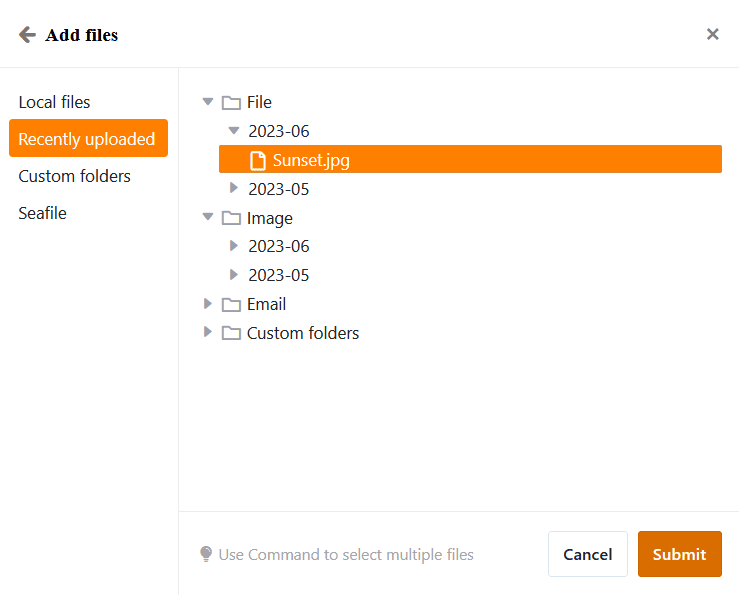

В **колонке файла** можно сохранить один или несколько файлов и таким образом добавить документы в соответствующую строку.

## Как создать колонку файлов

1. Нажмите на **символ \[+\]** справа от последнего столбца вашей таблицы.
2. Дайте столбцу **имя** в верхнем поле.
3. Выберите тип столбца **Файл** из выпадающего меню.

## Загрузка новых файлов

Вы можете **загружать файлы** в колонку файлов, щелкнув мышью по **ячейке** и выбрав появившийся **символ плюса**. Вы можете **перетащить** файлы во вновь открывшееся окно или щелкнуть мышью, чтобы загрузить файлы с устройства.



### Одновременная загрузка нескольких новых файлов

1. Щелкните в **ячейке** столбца файла.
2. Нажмите на появившийся **символ плюса**.
3. Откроется новое окно. Здесь вы можете загружать файлы с вашего устройства с помощью **перетаскивания** или **щелчка мыши**.
4. Выберите сразу несколько файлов, выделив все документы, которые вы хотите загрузить, и загрузив их вместе.



## Добавление существующих файлов

Помимо новых файлов, которые вы загружаете локально в ячейку столбца файлов, вы также можете добавлять существующие файлы, которые могут поступать из **трех источников**:

- **Последние загрузки**: Здесь вы найдете последние загруженные файлы, сохраненные в [файловом менеджере](https://seatable.io/ru/docs/dateien-und-bilder/das-dateimanagement-einer-base/) Base.
- **Мои папки**: здесь вы получаете доступ к файлам в своих собственных папках, которые вы можете создавать и заполнять в [файловом менеджере](https://seatable.io/ru/docs/dateien-und-bilder/das-dateimanagement-einer-base/).
- **Seafile**: Здесь вы можете выбрать файлы из [библиотек Seafile](https://seatable.io/ru/docs/integrationen-innerhalb-von-seatable/eine-seafile-bibliothek-an-seatable-anbinden/), которые подключены к вашей базе.

1. Щелкните в **ячейке** столбца файлов, а затем на появившемся **символе плюса**.
2. Откроется новое окно. В навигации слева выберите **источник**, из которого вы хотите добавить файл.
3. Перейдите по **структуре папок к** нужному файлу.
4. Выберите **файл** и вставьте его в ячейку с помощью **Submit**.

## Загрузка файла

1. В столбце "Файл" **дважды щелкните** по ячейке, содержащей документы, которые вы хотите загрузить.
2. Откроется новое окно. Здесь перечислены **все файлы**, хранящиеся в ячейке.
3. Таким образом, вы можете создать **один файл** скачать:
    - Наведите указатель мыши на документ и нажмите на **значок загрузки** .
4. Так что вы можете **несколько файлов** скачать:
    - Нажмите кнопку **Выбрать**.
    - Выберите опцию **Выбрать все** или поставьте **галочки** в полях напротив файлов.
    - Затем нажмите кнопку **Загрузить**.

Если вы хотите загрузить все файлы в колонке, откройте выпадающее меню над заголовком колонки и выберите **Загрузить все**.

Вы можете задать **собственное имя файла**, и на экране отобразится **количество файлов**, содержащихся в экспортируемом файле.

Если вы нажмете на **три точки**, у вас будет два варианта сохранения файла: При **загрузке** на вашем устройстве сохраняется zip-файл, из которого вы можете извлечь все файлы. Вы также можете **сохранить** файлы **в Seafile**. Для этого необходимо сначала [подключить библиотеку Seafile к вашей базе](https://seatable.io/ru/docs/integrationen-innerhalb-von-seatable/eine-seafile-bibliothek-an-seatable-anbinden/).

## Переименовать файлы

1. Откройте окно **Все файлы**, **дважды щелкнув** по ячейке в столбце Файл.
2. Наведите указатель мыши на файл, который вы хотите переименовать, и нажмите на **три точки**.
3. Выберите опцию **Переименовать** и введите новое **имя файла**.

## Удаление файлов

1. Откройте окно **Все файлы**, **дважды щелкнув** по ячейке в столбце Файл.
2. Таким образом, вы можете создать **один файл** Удалить
    - Наведите указатель мыши на файл, который вы хотите удалить, и нажмите на **три точки**.
    - Выберите опцию **Удалить**.
3. Так что вы можете **несколько файлов** Удалить
    - Нажмите кнопку **Выбрать**.
    - Выберите опцию **Выбрать все** или поставьте **галочки** в полях напротив файлов.
    - Нажмите **Удалить**.



## Часто задаваемые вопросы



Можно ли загрузить файл во время совместного доступа для чтения?|||

Да. Даже если пользователь имеет **разрешение** только **на чтение**, он может загружать файлы.

---

Можно ли воспроизводить аудиофайлы в SeaTable?|||

Нет. Чтобы иметь возможность воспроизводить **аудиофайлы**, их необходимо сначала загрузить.

---

Можно ли изменить порядок следования файлов в колонке файлов?|||

Нет, порядок **не может** быть изменен в колонке файла. Документ, загруженный первым, идет первым. По порядку загрузки документов можно определить порядок в колонке файлов.


