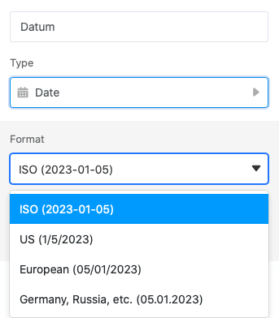
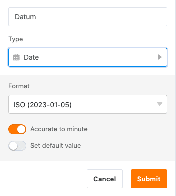
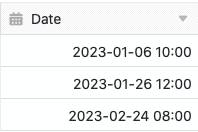

Mithilfe der Datum-Spalte können Sie **Zeitpunkte** und **Termine** bis auf die Minute genau in Ihren Tabellen erfassen. Nutzen Sie einfach den eingeblendeten Kalender oder Ihre Tastatur, um ein Datum manuell einzugeben. Beachten Sie dabei, dass SeaTable keine anderen Dateninputs in einer Datum-Spalte akzeptiert.

## Anlegen einer Datum-Spalte

Beim Anlegen einer Datum-Spalte können Sie zunächst ein passendes **Format** je nach Region und Norm auswählen.

Darüber hinaus können Sie entscheiden, ob Sie das Datum auf die **Minute** genau oder lediglich den **Tag** erheben möchten. Aktivieren Sie dazu den Regler:

Mit dem zweiten Regler können Sie einstellen, ob immer, wenn Sie eine neue Zeile anlegen, bereits ein **Standardwert** (zum Beispiel ein bestimmtes oder das aktuelle Datum) eingetragen sein soll.

Bestätigen Sie den Dialog, um die Datum-Spalte anzulegen. Im Anschluss können Sie in jeder Zeile ein beliebiges Datum aus dem eingeblendeten **Kalender** auswählen oder über Ihre **Tastatur** eingeben.

**Erhobene Daten: auf die Minute genau**

**Erhobene Daten: ausschließlich Tag**

