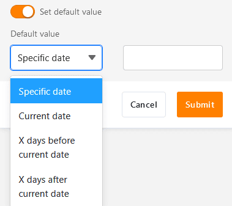
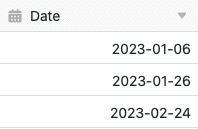

Puede utilizar la columna de fecha para introducir **horas** y **fechas** en sus tablas con una precisión de un minuto. Simplemente utilice el calendario que aparece o su teclado para introducir una fecha manualmente. Tenga en cuenta que SeaTable no acepta ninguna otra entrada de datos en una columna de fecha.

## Crear una columna de fecha

Al crear una columna de fecha, puede seleccionar primero un **formato** adecuado en función de la región y la norma.

Además, puede decidir si desea elevar la fecha al **minuto** o sólo al **día**. Para ello, active el control deslizante:

Con el segundo control deslizante, puede establecer si debe introducirse ya un **valor por defecto** (por ejemplo, una fecha específica o la fecha actual) cada vez que cree una nueva línea.

Confirme el diálogo para crear la columna de fecha. A continuación, puede seleccionar cualquier fecha de cada fila en el **calendario** que aparece o introducirla con el **teclado**.

**Datos recogidos: precisión al minuto**

**Datos recogidos: sólo día**

