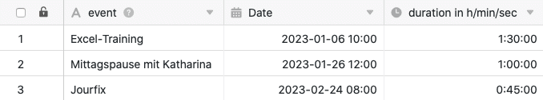
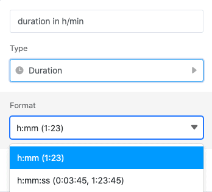
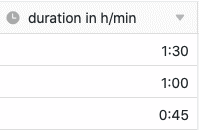
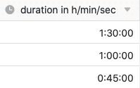

**Колонка продолжительности** особенно подходит для записи продолжительности различных событий. Он может записывать **период времени** с точностью до минуты или даже до секунды. Например, столбец продолжительности может использоваться в сочетании со столбцом [даты]() для учета рабочих часов.

## Создание постоянной колонки

При создании колонки длительности вы можете решить, хотите ли вы увеличить длительность до **минуты** или даже до **секунды**.

### Постоянная колонка с точностью до минуты

### Непрерывная колонна до второй

