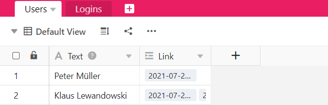
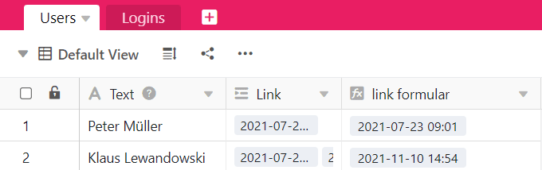

**Формула Findmax** ищет **максимальное значение** среди записей связанного столбца и возвращает его. Это полезно, если в связанной таблице есть **несколько записей**, которые ссылаются на одну и ту же запись (например, о человеке) в другой таблице.

Формула Findmax работает только с **числовыми значениями**, поэтому содержимое связанного столбца также должно состоять из числовых значений. Кроме того, использование формулы Findmax имеет смысл только в том случае, если при создании столбца **Связать с другими записями** активирован ползунок **Разрешить связывание с несколькими строками**. Если бы опция была выключена, формула Findmax всегда содержала бы то же число, что и в связанном столбце.

## Для чего вам нужна формула Findmax

**Функцию Findmax** следует использовать, когда необходимо провести **перекрестное сравнение** числовых значений, хранящихся в разных таблицах. Допустим, вы используете SeaTable для сбора данных о **рабочем времени** ваших сотрудников, где в одной таблице хранятся сотрудники, а в другой - ежедневная деятельность. Затем вы можете связать каждую запись о сотруднике с введенными рабочими часами.

Чтобы узнать, когда сотрудник последний раз входил в систему, можно использовать **формулу Findmax** для отображения **наибольшего значения** - в данном случае последнего времени - из общего количества времени входа в систему в столбце.

Вы можете использовать формулу Findmax со всеми числовыми значениями для представления **максимального значения**.

## Чтобы использовать формулу Findmax

### Добавить ссылку на таблицу

Информацию о том, как создать колонку типа **Link to Other Entries**, см. в статье [Как связать таблицы в SeaTable](). Это основное требование для того, чтобы иметь возможность использовать формулу Findmax.

### Добавить столбец с формулой Findmax

1. Создайте новый столбец типа **Формула для ссылок**.
2. Установите параметр **Findmax** в качестве формулы.
3. Выберите ранее созданный столбец типа **Связь с другими записями** в этой таблице.
4. В поле **Select look-up column in the linked table "..."** укажите столбец из другой таблицы, который необходимо связать со столбцом здесь.
5. Нажмите **Отправить**.


