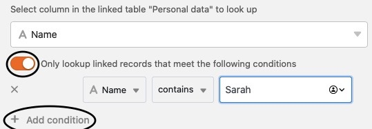

A função de pesquisa permite-lhe exibir valores adicionais de uma tabela já ligada na sua tabela actual. Isto evita que tenha de introduzir os dados duas vezes e ao mesmo tempo pode relacionar os dados uns com os outros. No Excel esta função é conhecida como _VLOOKUP_ ou _SVERWEIS_.

## Quando é que precisa da fórmula de pesquisa?

A função de pesquisa deve ser utilizada sempre que se pretenda cruzar informações armazenadas em diferentes tabelas. Digamos que está a utilizar o SeaTable para a [gestão de projectos](https://seatable.io/pt/projektmanagement/), onde os projectos são armazenados numa tabela e as tarefas associadas ao projecto são armazenadas noutra tabela. Cada projecto é então ligado a um conjunto de tarefas.

Como gestor de projecto, poderá querer exibir informação sobre as tarefas associadas a cada projecto. A fórmula Lookup pode ser utilizada para seleccionar uma coluna na tabela ligada e exibir os seus valores. Por exemplo, pode exibir automaticamente os membros do projecto que são responsáveis por cada tarefa.

Isto pode ser útil para um fácil acesso à informação de tabelas cruzadas, criação de automatismos, fórmulas, etc. A seguir, aprenderá mais sobre a utilização da função de pesquisa.

## Para utilizar a coluna Lookup

### Acrescentar uma ligação de tabela

A função de pesquisa só pode ser utilizada se já existir uma coluna do tipo _Link para outras entradas_. Se ainda não tiver uma coluna deste tipo, crie uma primeiro. Pode descobrir como isto funciona [aqui]().

### Adicionar uma Fórmula de Pesquisa

No início, a fórmula de pesquisa pode confundi-lo. Mas em breve verá que vai adorar esta função de coluna incrivelmente versátil e poderosa. Para adicionar uma coluna com a fórmula Lookup:

1. Criar uma nova coluna do tipo **Fórmula para links**.
2. Defina a opção **Lookup** como a fórmula.
3. Seleccione uma **coluna de ligação**. Este campo é automaticamente preenchido correctamente se tiver apenas uma coluna de ligação.
4. Com a **coluna da tabela ligada**, determina-se de que coluna da outra tabela devem ser retirados os valores.
5. Clique em **Submeter**.

## Perguntas mais frequentes sobre a coluna Lookup



É possível obter vários valores numa só tabela através de uma pesquisa?|||

Definitivamente. Basta criar outra coluna e utilizar novamente a função de pesquisa. Desta forma, pode ler e exibir toda a informação que desejar a partir da tabela ligada.

---

As consultas podem ser alteradas posteriormente?|||

É claro que isto é possível. Clicar no **símbolo do triângulo** à direita do nome da coluna e depois no **tipo de coluna Personalizar**. Ajustar as definições da coluna e imediatamente é exibida a informação desejada.

---

Os lookups funcionam com múltiplas ligações?|||

Cada fórmula de pesquisa só pode ir buscar a informação a partir de **uma** coluna das suas tabelas ligadas. Mas é claro que pode ligar várias tabelas através de colunas de ligação e criar mais colunas de pesquisa para ler e exibir ainda mais informação.

---

As entradas que são consultadas por pesquisa podem ser filtradas?|||

Sim, pode filtrar as entradas como desejar. Para o fazer, active o correspondente **Controlador** no _Configuração das colunas_ e seleccione o **Coluna(s)** cujas entradas devem ser consultadas. Pode seleccionar qualquer número de **Condições de filtragem** definir.  


