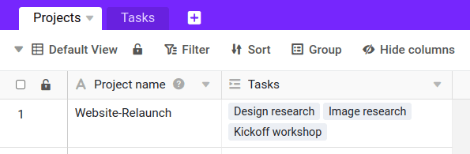

Функция поиска позволяет отображать дополнительные значения из уже связанной таблицы в текущей таблице. Это позволит вам не вводить данные дважды, и в то же время вы сможете соотнести их друг с другом. В Excel эта функция известна как _VLOOKUP_ или _SVERWEIS_.

## Когда вам нужна формула поиска?

Функцию поиска следует использовать всякий раз, когда необходимо сопоставить информацию, хранящуюся в разных таблицах. Допустим, вы используете SeaTable для [управления проектами](https://seatable.io/ru/projektmanagement/), где проекты хранятся в одной таблице, а задачи, связанные с проектом, - в другой. Каждый проект затем связывается с набором задач.

Будучи менеджером проекта, вы можете захотеть отобразить информацию о задачах, связанных с каждым проектом. Формулу Lookup можно использовать для выбора столбца в связанной таблице и отображения его значений. Например, можно автоматически отобразить членов проекта, ответственных за каждую задачу.

Это может быть полезно для легкого доступа к информации из кросс-таблиц, настройки автоматизаций, формул и т.д. Далее вы узнаете больше об использовании функции поиска.

## Чтобы использовать колонку "Поиск

### Добавить ссылку на таблицу

Функция поиска может быть использована только в том случае, если колонка типа _Ссылка на другие записи_ уже существует. Если у вас еще нет такой колонки, сначала создайте ее. Вы можете узнать, как это работает, [здесь]().

### Добавить формулу поиска

Сначала формула поиска может сбить вас с толку. Но вскоре вы убедитесь, что вам понравится эта невероятно универсальная и мощная функция колонки. Чтобы добавить столбец с формулой Lookup:

1. Создайте новый столбец типа **Формула для ссылок**.
2. Установите параметр **Lookup** в качестве формулы.
3. Выберите **колонку ссылок**. Это поле автоматически заполняется правильно, если у вас только один столбец ссылок.
4. С помощью **столбца поиска в связанной таблице** вы определяете, из какого столбца другой таблицы нужно взять значения.
5. Нажмите **Отправить**.

## Часто задаваемые вопросы о колонке "Поиск

Определенно. Просто создайте другой столбец и снова используйте функцию поиска. Таким образом, вы можете считывать и отображать столько информации, сколько хотите, из связанной таблицы.

Это, конечно, возможно. Нажмите на **символ треугольника** справа от названия колонки, а затем на **Настроить тип колонки**. Настройте параметры колонки, и сразу же на экране появится нужная информация.

Каждая формула поиска может получать информацию только из **одного** столбца ваших связанных таблиц. Но, конечно, вы можете связать несколько таблиц с помощью колонок связей и создать дополнительные колонки поиска, чтобы считывать и отображать еще больше информации.

Да, вы можете фильтровать записи по своему усмотрению. Для этого активируйте соответствующий **Контроллер** в _Настройки колонок_ и выберите **Колонка(и)** записи которых необходимо найти. Вы можете выбрать любое количество **Условия фильтрации** определить.


