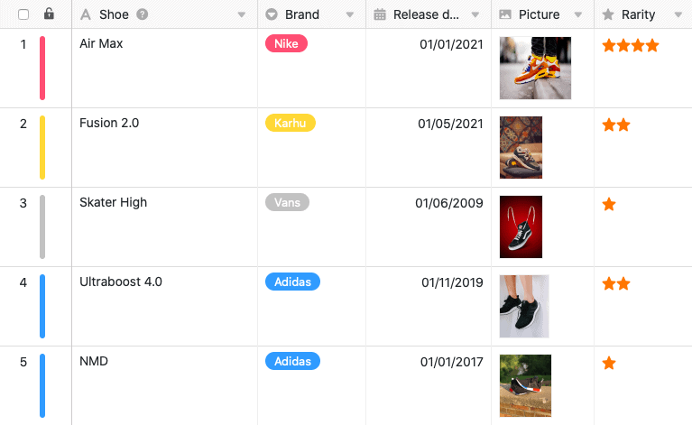
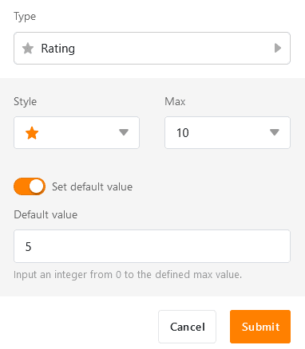

A coluna de Classificação permite-lhe **classificar** os seus registos de modo a **classificá-los** ou dar-lhes uma classificação de **qualidade**. Ao criar a coluna, pode fazer configurações específicas relativamente à aparência e ao número máximo de **símbolos de classificação** permitidos.

## Criar a coluna de classificação

1. Seleccione **Rating** como o tipo de coluna e dê um **nome** à nova coluna.

3. Definir um **símbolo de classificação**.

5. Determinar o **número** máximo **de pontos** permitido **de 1 a 10**.

7. Pode definir um **valor prede** finido que aparece automaticamente em cada nova linha. Se não ativar a barra deslizante, a pontuação predefinida é 0.

9. Confirmar com **Submeter**.

## Fazer e alterar a avaliação

Quando se **clica** numa **célula** numa coluna de classificação, o número máximo possível de símbolos é apresentado em cinzento pálido. Para fazer uma classificação na escala de classificação, basta clicar no símbolo de classificação que marca a pontuação desejada. Para ajustar uma classificação existente, proceder de forma idêntica.

## Apagar classificação

Para **apagar** uma avaliação já efectuada numa linha, clique no **valor actual** ou seleccione a célula e prima a **tecla** **Backspace** ou **Delete** no seu teclado.
