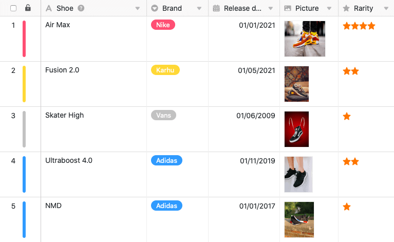
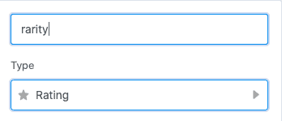
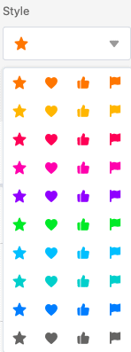
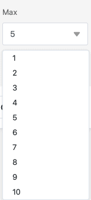
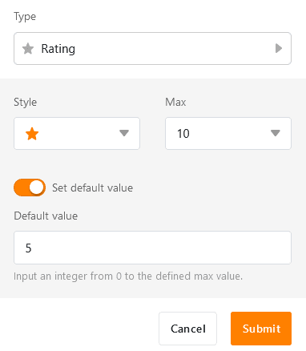
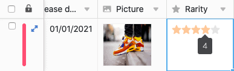

Колонка "Рейтинг" позволяет **классифицировать** записи, чтобы **проранжировать** их или присвоить им **оценку качества**. При создании колонки можно задать определенные настройки, касающиеся внешнего вида и максимального количества разрешенных **символов рейтинга**.

## Создание колонки рейтинга

1. Выберите **Рейтинг** в качестве типа столбца и дайте новому столбцу **имя**.

3. Установите **символ рейтинга**.

5. Определите максимально допустимое **количество баллов от 1 до 10**.

7. Можно задать **значение по умолчанию**, которое будет автоматически появляться в каждой новой строке. Если не активировать ползунок, то значение по умолчанию будет равно 0.

9. Подтвердите с помощью кнопки **Отправить**.

## Проводить и изменять оценку

Когда вы **щелкаете** по **ячейке** в колонке рейтинга, максимально возможное количество символов отображается бледно-серым цветом. Чтобы поставить оценку по шкале оценок, просто нажмите на символ оценки, которым отмечен нужный балл. Для корректировки существующего рейтинга действуйте аналогично.

## Удалить рейтинг

Чтобы **удалить** оценку, уже сделанную в строке, либо щелкните по **текущему значению**, либо выделите ячейку и нажмите клавишу **Backspace** или **Delete** на клавиатуре.
