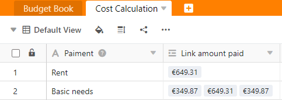

Con la ayuda de la fórmula roll-up del tipo de columna **Fórmula para enlaces**, puede establecer varios valores numéricos de una columna enlazada en relación con los demás y realizar cálculos estadísticos sencillos.

## Ámbito de aplicación de la fórmula roll-up

Con la **fórmula rollup** es posible determinar relaciones entre valores numéricos. Por ejemplo, en la planificación presupuestaria puede **sumar** los gastos de una categoría, calcular el **valor** **máximo** o **mínimo** gastado o incluso la **media**.

Primero necesita una columna del tipo [Enlace a otras entradas](). Asegúrese de que la opción **Permitir enlaces a varias filas** está activada, porque es la única forma de determinar relaciones entre números.

A continuación, la columna **Fórmula para** enlace muestra la relación seleccionada de los valores numéricos dentro de la columna de enlace utilizando la fórmula de rollup. En este ejemplo hemos elegido el método de evaluación **Suma:**

## Añadir un enlace a la tabla

Lea en el artículo [Cómo enlazar tablas en SeaTable]() cómo crear una columna del tipo **Enlace a otras entradas**. Este es un requisito básico para poder utilizar la fórmula rollup.

El uso de la fórmula desplegable sólo tiene sentido si activa la opción **Permitir enlace a varias filas** al crear una columna de enlace. Si la opción estuviera desactivada, el campo de la fórmula roll-up contendría siempre el mismo valor de la columna de enlace.

## Crear una columna con la fórmula de rollup

1. Cree una nueva columna del tipo **Fórmula para los enlaces**.
2. Establezca la opción **Rollup** como fórmula.
3. Seleccione la **columna de enlace** que enlaza con la tabla deseada.
4. Ahora decida en el campo **Seleccionar columna a fusionar** de la **tabla vinculada** qué columna de la tabla deseada desea vincular y evaluar.
5. Establezca el **método de evaluación**. Puede elegir entre media, mínimo, máximo, suma y concatenación.
6. Haga clic en **Enviar**.

## Ajustes de formato

Puede definir con precisión el **formato** en que se muestran los valores numéricos. Para ello, haga clic en el **símbolo** triangular **desplegable de** la columna "Fórmula para los enlaces" y seleccione la opción **Ajustes de formato**. Además de números, también puede tomar como formato **divisas**, **porcentajes** y **duraciones**.
