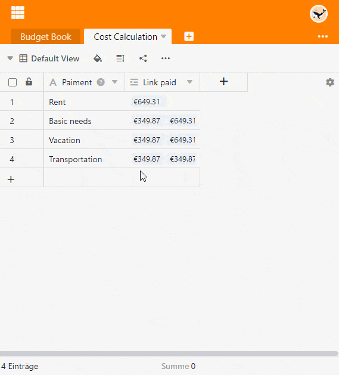

Com a ajuda da fórmula de roll-up do tipo de coluna **Fórmula para ligações**, é possível definir vários valores numéricos de uma coluna ligada em relação umas às outras e efectuar cálculos estatísticos simples.

## Âmbito de aplicação da fórmula de roll-up

Com a **fórmula de rollup** é possível determinar as relações entre os valores numéricos. Por exemplo, no planeamento orçamental pode **resumir** as despesas de uma categoria, calcular o **valor** **máximo** ou **mínimo** gasto ou mesmo a **média**.

Primeiro é necessária uma coluna do tipo [Link para outras entradas](). Certifique-se de que a opção **Permitir ligações a várias filas** é activada, porque esta é a única forma de determinar as relações entre números.

A coluna **Fórmula para Ligação** mostra-lhe então a relação seleccionada dos valores numéricos dentro da coluna de ligação utilizando a fórmula de rollup. Neste exemplo, escolhemos o método de avaliação **Sumário**:

## Acrescentar uma ligação de tabela

Leia no artigo [Como ligar tabelas no SeaTable]() como criar uma coluna do tipo **Ligar a outras entradas**. Este é um requisito básico para se poder utilizar a fórmula de enrolamento.

A utilização da fórmula de enrolar só faz sentido se activar a opção **Permitir ligação a múltiplas linhas** ao criar uma coluna de ligação. Se a opção fosse desligada, o campo da fórmula de enrolar conteria sempre o mesmo valor da coluna de ligação.

## Criar uma coluna com a fórmula de rollup

1. Criar uma nova coluna do tipo **Fórmula para links**.
2. Defina a opção **Rollup** como a fórmula.
3. Seleccione a **coluna de ligação** que liga à tabela desejada.
4. Decida agora, no campo **Seleccionar a coluna a fundir** na **tabela ligada**, qual a coluna da tabela desejada que pretende ligar e avaliar.
5. Definir o **método de avaliação**. Tem média, mínimo, máximo, soma e concatenação à escolha.
6. Clique em **Submeter**.

## Definições de formato

Pode definir com precisão o **formato** em que os valores numéricos são apresentados. Para tal, clique no **símbolo** triangular **da** coluna "Fórmula para ligações" e seleccione a opção **Definições de formato**. Para além dos números, também pode utilizar **moedas**, **percentagens** e **durações** como formato.
