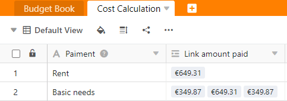
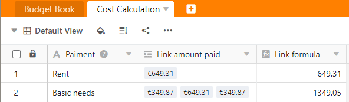
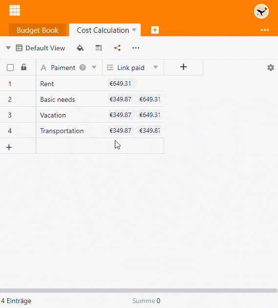

С помощью свернутой формулы столбца типа **Формула для связей** можно установить несколько числовых значений связанного столбца относительно друг друга и выполнить простые статистические расчеты.

## Сфера применения формулы сворачивания

С помощью **формулы свертывания** можно определить отношения между числовыми значениями. Например, при планировании бюджета вы можете **суммировать** расходы по категории, рассчитать **максимальное** или **минимальное** потраченное **значение** или даже **среднее**.

Сначала вам нужен столбец типа [Ссылка на другие записи](). Убедитесь, что опция **Разрешить ссылки на несколько строк** активирована, поскольку это единственный способ определить отношения между числами.

Затем в столбце **Формула для ссылки** отображается выбранное отношение числовых значений в столбце ссылки с помощью формулы сворачивания. В данном примере мы выбрали метод оценки **Sum**:

## Добавить ссылку на таблицу

Читайте в статье [Как связать таблицы в SeaTable](), как создать колонку типа **Link to Other Entries**. Это основное требование для использования формулы свертывания.

Использование формулы сворачивания имеет смысл только в том случае, если при создании колонки ссылок активирована опция **Разрешить ссылки на несколько строк**. Если бы опция была выключена, поле формулы сворачивания всегда содержало бы одно и то же значение колонки ссылок.

## Создайте столбец с формулой свертывания

1. Создайте новый столбец типа **Формула для ссылок**.
2. Установите параметр **Rollup** в качестве формулы.
3. Выберите **колонку ссылок**, которая ссылается на нужную таблицу.
4. Теперь определите в поле **Select column to be merged** в **связанной таблице**, какой столбец из нужной таблицы вы хотите связать и оценить.
5. Установите **метод оценки**. Вы можете выбрать среднее значение, минимум, максимум, сумму и конкатенацию.
6. Нажмите **Отправить**.

## Настройки формата

Вы можете точно определить **формат** отображения числовых значений. Для этого необходимо щелкнуть на треугольном **значке раскрывающегося** столбца "Формула для ссылок" и выбрать опцию **Настройки формата**. Кроме чисел, в качестве формата можно взять **валюты**, **проценты** и **длительности**.
