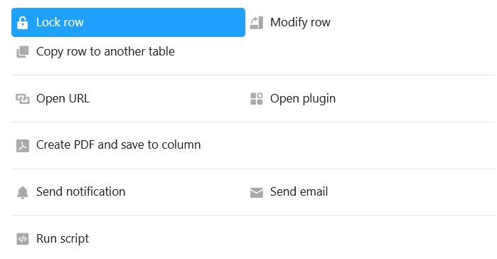

The Button column has a similar function to [automations](https://seatable.io/en/docs/arbeiten-mit-automationen/anlegen-einer-automation/), where you always have to operate buttons **manually**. Using the **button** you can add in this column to your **rows** you trigger **actions** defined in advance. For this reason, this type of column is particularly suitable for automating process steps.

## Creating the button

First, name the **column** and set the **label** and **color of the button** you want to add to your rows .

In the next step, you define any number of **actions** that are to be triggered by activating the button. Thereby you have the possibility to switch **several** actions one after the other.

You can choose between **nine** different actions in total:

- row lock
- row edit
- row copy to another table
- Open URL
- Open plugin (only possible if you have activated at least one [plugin](https://seatable.io/en/docs/arbeiten-mit-plugins/was-ist-ein-plugin/) )
- Save PDF file in column (only possible if [page design plugin](https://seatable.io/en/docs/seitendesign-plugin/anleitung-zum-seitendesign-plugin/) is enabled)
- Send notification
- Send e-mail
- Run script

## Application example

In this application example we use the button to assign the status "paid" to paid invoices by mouse click. For this purpose we take the action **row edit**.

In the **column settings** we specify that the entries in the single-selection column **"status"** are set from **"pending"** to **"paid** **"** by activating the button.

After clicking the button, the **status of** the selected invoice changes to **paid.**

### Additional option

To extend the automation of process steps, you can also use buttons in combination with [automations]() them for processing.

