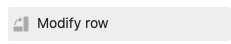
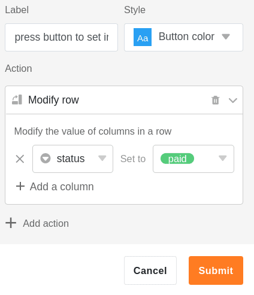
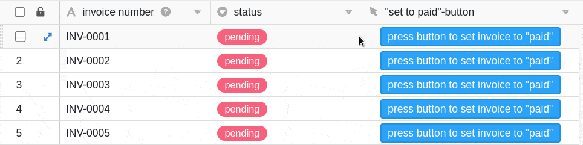
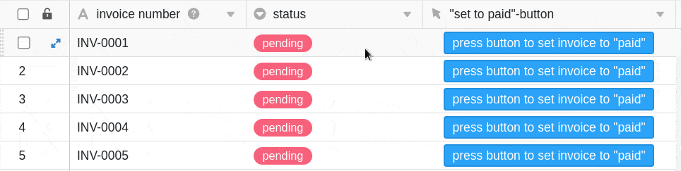

A coluna de botões tem uma função semelhante às [automatizações](https://seatable.io/pt/docs/arbeiten-mit-automationen/anlegen-einer-automation/), em que tem sempre de operar botões **manualmente**. Com a ajuda do **botão** que pode adicionar às suas **filas** nesta coluna, desencadeia **acções** definidas antecipadamente. Por esta razão, este tipo de coluna é particularmente adequado para automatizar etapas de processo.

## Criar o botão

Primeiro, nomeie a **coluna** e defina o **rótulo** e a **cor do botão** que pretende adicionar às suas linhas.

No passo seguinte, define-se qualquer número de **acções** que devem ser desencadeadas através da activação do botão. Tem a opção de mudar **várias** acções em sucessão.

Pode escolher entre um total de **nove** acções diferentes:

- Linha de bloqueio
- Linha de edição
- Fila de cópia para outra tabela
- Abrir URL
- Abrir o plugin (só é possível se tiver ativado pelo menos um [plugin](https://seatable.io/pt/docs/arbeiten-mit-plugins/was-ist-ein-plugin/) )
- Guardar o ficheiro PDF em coluna (só é possível se o [plug-in de design de página]() estiver ativado)
- Enviar notificação
- Enviar e-mail
- Executar guião

## Exemplo de aplicação

Neste exemplo de aplicação, utilizamos o botão para atribuir o estado "pago" a facturas pagas com um clique do rato. Para isso, utilizamos a ação **Editar linha**.

Nas **definições da coluna**, especificamos que as entradas na coluna de seleção única **"estado** " são definidas de **"pendente"** para **"pago** **"** ao ativar o botão.

Depois de clicar no botão, o **estado da** factura seleccionada muda para **paga**.

### Possibilidade adicional

Para estender a automatização das etapas do processo, também se pode utilizar botões em combinação com [automatizações]() as **linhas** com as respectivas facturas que foram definidas para serem pagas para processamento.

