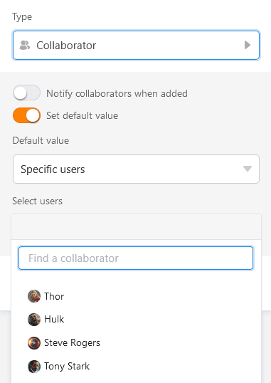

En la **columna de empleados**, puede asignar una o más **personas** a una fila. SeaTable le permite seleccionar las personas que actualmente tienen **acceso** a la **base**, así como todos los demás miembros del equipo sin acceso.

## Seleccionar a las personas con acceso a la base

Si **hace doble clic** en una celda de una columna de empleados, aparecerá una lista con todos los usuarios que actualmente tienen acceso a la base. Seleccione una o varias de estas **personas**. También puede utilizar el **campo de búsqueda** para encontrar un usuario concreto.



## Seleccionar miembros del equipo sin acceso a la base

Si no puede encontrar a un usuario a través del campo de búsqueda en la columna de empleados, significa que actualmente **no** tiene **acceso** a la base. Sin embargo, si es **miembro de su equipo**, puede introducirlo en la columna de empleados.

Haga clic en el icono  para añadir miembros del equipo sin acceso. Introduzca el nombre del usuario en el **campo de búsqueda**, seleccione el **miembro** del equipo deseado y confirme con **Añadir**.

## Notificación al empleado cuando se añade

Al crear una columna de empleados, puede **activar** el **control deslizante** para que los empleados reciban una [notificación](https://seatable.io/es/docs/benachrichtigungen/sinn-und-zweck-von-benachrichtigungen-in-seatable/) cuando otros los introduzcan en la columna y así asignarlos a una fila.

Los empleados reciben entonces la notificación correspondiente en Base, a la que pueden acceder a través del **símbolo de campana**  situado en la esquina superior derecha.

## Establecer el valor por defecto

Puede establecer uno o varios empleados como [valor por defecto]() en una columna de empleados. Las opciones **Usuario actual** o **Usuarios** específicos están disponibles para la selección. Cada vez que alguien añade una nueva fila a la tabla, el creador de la fila o las personas seleccionadas se introducen automáticamente en la columna de empleados.

## Seleccionar empleados como destinatarios de notificaciones automatizadas

Al enviar notificaciones mediante [automatizaciones](), puede seleccionar como destinatarios del mensaje a todas las personas introducidas en la columna de empleados.

## La columna de empleados en las aplicaciones universales

La columna de empleados también es una ventaja en la [app Universal](). Puedes activar la opción de que los miembros del equipo sean visibles para todos los usuarios en la lista desplegable de los [ajustes de]() la app.

Si no desea que los usuarios de la app puedan ver los registros de datos de otros usuarios, defina **filtros preestablecidos**: si una página se filtra por la columna de empleados con la condición "incluye al usuario actual", cada usuario de la app universal sólo verá las entradas que se le asignen en la tabla.

