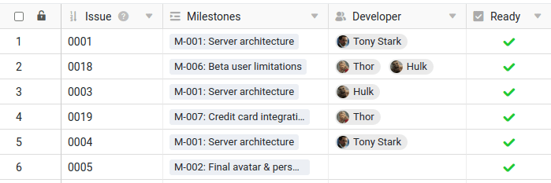
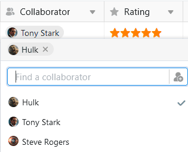
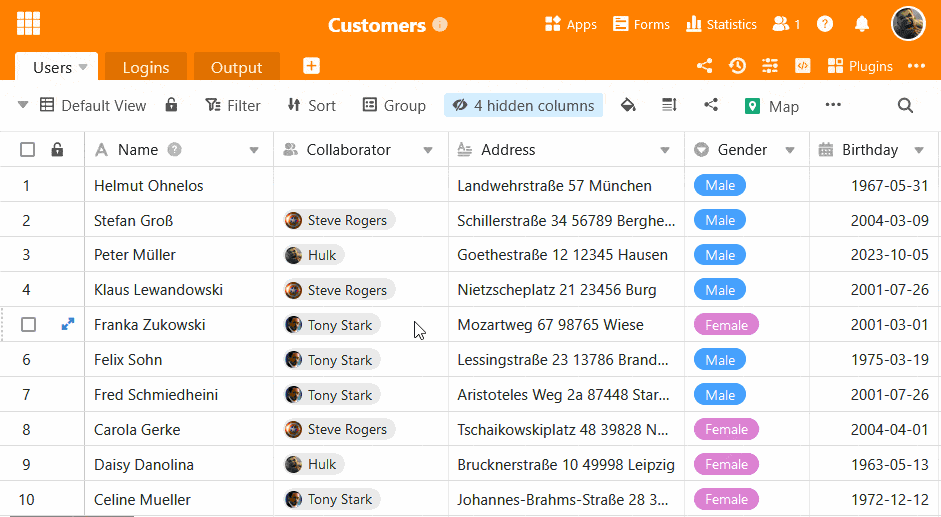
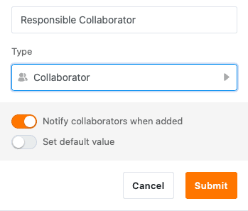
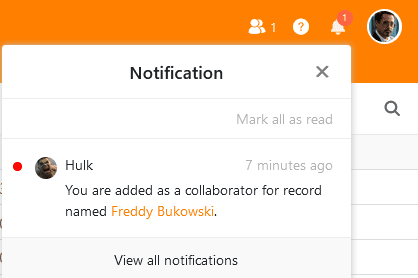
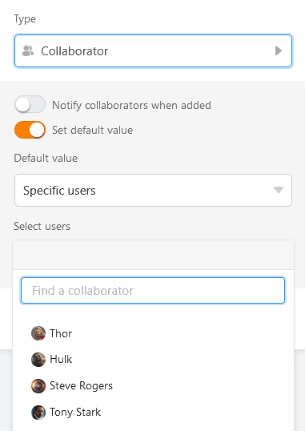
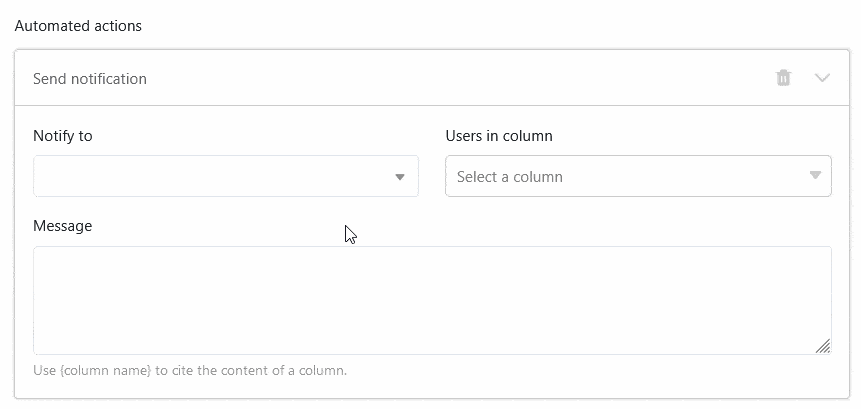
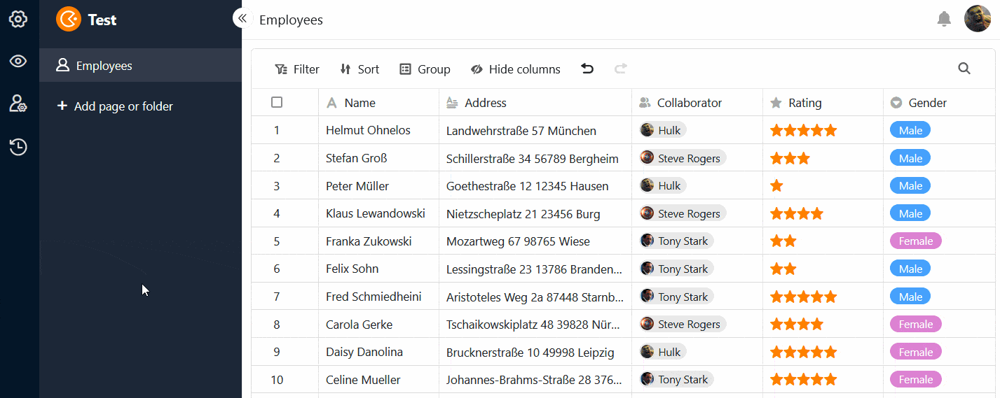

Dans la **colonne des collaborateurs**, vous pouvez attribuer une ou plusieurs **personnes** à une ligne. SeaTable vous permet de sélectionner aussi bien les personnes qui ont actuellement **accès** à la **base** que tous les autres membres de l'équipe qui n'y ont pas accès.

## Sélectionner les personnes ayant accès à la base

Si vous **double-cliquez** dans une cellule d'une colonne de collaborateurs, une liste de tous les utilisateurs qui ont actuellement accès à la base apparaît. Sélectionnez une ou plusieurs de ces **personnes**. Vous pouvez également utiliser le **champ de recherche** pour trouver un utilisateur spécifique.



## Sélectionner des membres de l'équipe sans accès à la base

Si vous ne pouvez pas trouver un utilisateur via le champ de recherche dans la colonne des collaborateurs, cela signifie qu'il n'a actuellement **pas accès** à la base. S'il est **membre de votre équipe**, vous pouvez tout de même le saisir dans la colonne des collaborateurs.

Cliquez sur l'icône  pour ajouter des membres d'équipe sans accès. Saisissez le nom de l'utilisateur dans le **champ de recherche**, sélectionnez le **membre de l'équipe** souhaité et confirmez en cliquant sur **Ajouter**.

## Notification de l'employé lors de l'ajout

Lors de la création d'une colonne d'employés, vous pouvez **activer** le **curseur** pour que les employés reçoivent une [notification](https://seatable.io/fr/docs/benachrichtigungen/sinn-und-zweck-von-benachrichtigungen-in-seatable/) lorsque d'autres les inscrivent dans la colonne et les affectent ainsi à une ligne.

Les collaborateurs reçoivent ensuite une notification correspondante dans la base, qu'ils peuvent consulter via l'**icône de la cloche**  en haut à droite.

## Définir la valeur par défaut

Vous pouvez définir un ou plusieurs employés comme [valeur par défaut]() dans une colonne d'employés. Vous avez le choix entre l'**utilisateur actuel** et **certains utilisateurs**. Chaque fois que quelqu'un ajoute une nouvelle ligne dans le tableau, soit le créateur de la ligne, soit les personnes sélectionnées sont alors automatiquement inscrites dans la colonne des collaborateurs.

## Choisir les collaborateurs comme destinataires de notifications automatisées

Lorsque vous envoyez des notifications via [des automatismes](), vous pouvez sélectionner toutes les personnes inscrites dans la colonne des collaborateurs comme destinataires du message.

## La colonne des employés dans les applications universelles

La colonne des collaborateurs est également avantageuse dans l'[application universelle](). Vous pouvez activer l'option permettant de voir les membres de l'équipe dans la liste déroulante pour tous les utilisateurs dans les [paramètres]() de l'application.

Si vous ne souhaitez pas que les utilisateurs de l'application puissent voir les enregistrements d'autres utilisateurs, définissez **des filtres prédéfinis**: si une page est filtrée par la colonne des collaborateurs avec la condition "inclut l'utilisateur actuel", chaque utilisateur de l'application universelle ne verra que les enregistrements qui lui sont attribués dans le tableau.

