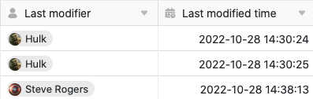
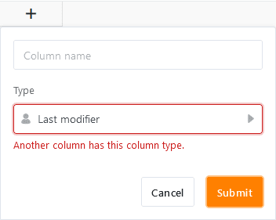

The columns **Last editor** and **Edited date** are exclusively filled **automatically** by SeaTable and therefore represent special column types. They prove to be extremely useful if you want to track **when** and **by whom** an entry was **last edited**.

Since the two columns automatically capture changes to entries, they are well suited, for example, as triggers for [automations](https://seatable.io/en/docs/arbeiten-mit-automationen/anlegen-einer-automation/) as well as for [filters](https://seatable.io/en/docs/ansichtsoptionen/filtern-von-eintraegen-in-einer-ansicht/) and [sorting](https://seatable.io/en/docs/ansichtsoptionen/sortieren-von-eintraegen-in-einer-ansicht/).

## The columns Last editor and Editing date

While SeaTable fills the **Last Ed** ited column with the name of the user who last edited a row , the **Edited Date** column records the exact time (date and time) when the last edit occurred.

## Special features of the two column types

- You **cannot** manually change the automatically entered values in the Last editor and Edit date columns. The values update themselves as soon as a change is made to a row .
- When **creating the** two types of columns, apart from the column name, **no** options are available.
- Only **one** column of each type can be created per table. If you try to create another column of the same type, the message "Another column has this column type." appears.

- For this reason, you cannot **duplicate** Last Edited and Edited Date columns **and customize their column type**.
