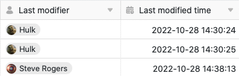

Колонки **Last** Edited и **Edited Date** заполняются SeaTable исключительно **автоматически** и поэтому являются колонками специального типа. Они оказываются чрезвычайно полезными, если необходимо отследить, **когда** и **кем** была **отредактирована** запись.

Поскольку эти два столбца автоматически регистрируют изменения записей, они хорошо подходят, например, в качестве триггеров для [автоматизации]() и [сортировки]().

## Колонки Последний редактор и Дата редактирования

В то время как SeaTable заполняет колонку **Last Edited** именем пользователя, который последний раз редактировал строку, в колонке **Edited Date** записывается точное время (дата и время), когда произошло последнее редактирование.

## Особенности двух типов колонн

- Вы **не можете** вручную изменить автоматически введенные значения в столбцах Дата последнего редактора и Дата редактирования. Эти значения обновляются самостоятельно, как только в строку вносится изменение.
- При **создании этих** двух типов столбцов **никакие** опции, кроме имени столбца, вам **не** доступны.
- В одной таблице может быть создан только **один** столбец соответствующего типа. Если попытаться создать еще один столбец того же типа, то появится сообщение "Another column has this column type".

- По этой причине нельзя **дублировать** столбцы Last Edited и Edited Date или **настраивать тип этих столбцов**.
