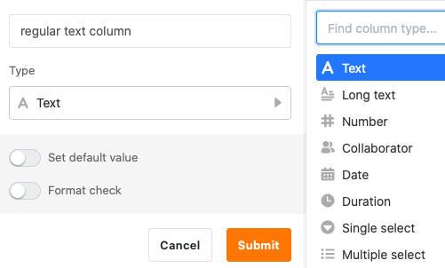

For capturing **strings** and **texts of** any kind, SeaTable provides you with two different column types: **Text** and **Formatted Text**. But what exactly is the difference between the two column types? And in which cases does it make sense to use the formatted text column?

## The text column

The text column is one of the most basic **column types** in SeaTable and is also displayed first in the column type selection menu.

In addition, SeaTable automatically adds a **text column** as the first column to each newly created table.

The **first column of** a table has several [peculiarities](https://seatable.io/en/docs/arbeiten-mit-spalten/die-besonderheiten-der-ersten-spalte/), as you can read in the linked article.

### Using the text column

The text column is particularly suitable for collecting short entries, such as **terms**, **names**, **words** or other **character strings** that do not have a calculable numerical value, e.g. addresses and telephone numbers.

When using the column, it makes sense to keep the entries **short**, since only a **limited number of characters** can be displayed without having to increase the column width.



There are two other text-based column types in SeaTable for special use cases: the [email column](https://seatable.io/en/docs/text-und-zahlen/die-e-mail-spalte-und-ihre-verwendung/) and the [URL column](https://seatable.io/en/docs/text-und-zahlen/die-url-spalte/).

### Set default value

You can define a preset [default value](https://seatable.io/en/docs/arbeiten-mit-spalten/standardwert-fuer-eine-spalte-festlegen/) for each text column. This is automatically entered in every new row of the table.

If you set the **{creator.name}** or **{creator.id}** reference as the default value, the **name** or **ID of the user** who added the row is automatically entered.

## The Formatted Text column

The **Formatted Text** column type is one of the more specific column types and is displayed second when you select the column type.

### Using the Formatted Text column

Formatted text columns are particularly suitable for holding **longer texts**, for example product descriptions, checklists or social media posts.

You do **not** write your entries directly in the cell, but in an **editor** that can be called up with a click, which offers various **formatting options**. In contrast to the text column, you can also structure longer texts.

Among other things, you can choose a **paragraph format**, italicize or bold the **font**, and insert **links**, **quotes**, **lists**, **tables**, and **images**.


