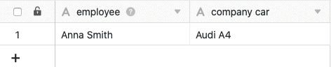

SeaTable proporciona dos tipos de columnas diferentes para introducir **cadenas** y **textos de** cualquier tipo: **Texto** y **Texto con formato**. Pero, ¿cuál es exactamente la diferencia entre los dos tipos de columna? ¿Y en qué casos tiene sentido utilizar la columna de texto formateado?

## La columna de texto

La columna de texto es uno de los **tipos de columna** más básicos en SeaTable y también se muestra en primer lugar en el menú de selección del tipo de columna.

Además, SeaTable añade automáticamente una **columna de texto** como primera columna a cada tabla recién creada.

La **primera columna de** una tabla tiene varias [características](https://seatable.io/es/docs/arbeiten-mit-spalten/die-besonderheiten-der-ersten-spalte/) especiales, como puedes leer en el artículo enlazado.

### Uso de la columna de texto

La columna de texto es especialmente adecuada para recoger entradas cortas, como **términos**, **nombres**, **palabras** u otras **cadenas de caracteres** que no tienen un valor numérico calculable, por ejemplo, direcciones y números de teléfono.

Al utilizar la columna, es conveniente que las entradas **sean cortas**, ya que sólo se puede mostrar un **número limitado de caracteres** sin tener que aumentar el ancho de la columna.



Existen otros dos tipos de columnas basadas en texto en SeaTable para casos de uso especiales: la [columna de correo electrónico](https://seatable.io/es/docs/text-und-zahlen/die-e-mail-spalte-und-ihre-verwendung/) y la [columna de URL](https://seatable.io/es/docs/text-und-zahlen/die-url-spalte/).

### Establecer el valor por defecto

Puede definir un [valor predeterminado](https://seatable.io/es/docs/arbeiten-mit-spalten/standardwert-fuer-eine-spalte-festlegen/) para cada columna de texto. Este valor se introduce automáticamente en cada nueva fila de la tabla.

Si especifica la referencia **{creator.name}** o **{creator.id}** como valor por defecto, se introduce automáticamente el **nombre** o el **ID del usuario** que ha añadido la fila.

## La columna Texto con formato

El tipo de columna **Texto con formato** es uno de los tipos de columna más específicos y se muestra en segundo lugar cuando se selecciona el tipo de columna.

### Uso de la columna Texto con formato

Las columnas de texto con formato son especialmente adecuadas para **textos largos**, como descripciones de productos, listas de control o publicaciones en redes sociales.

Las entradas **no** se escriben directamente en la celda, sino en un **editor** al que se accede con un clic y que ofrece diversas **opciones de formato**. A diferencia de la columna de texto, también puedes estructurar textos más largos.

Entre otras cosas, puedes elegir un **formato de párrafo**, poner la **fuente** en cursiva o negrita e insertar **enlaces**, **citas**, **listas**, **tablas** e **imágenes**.


