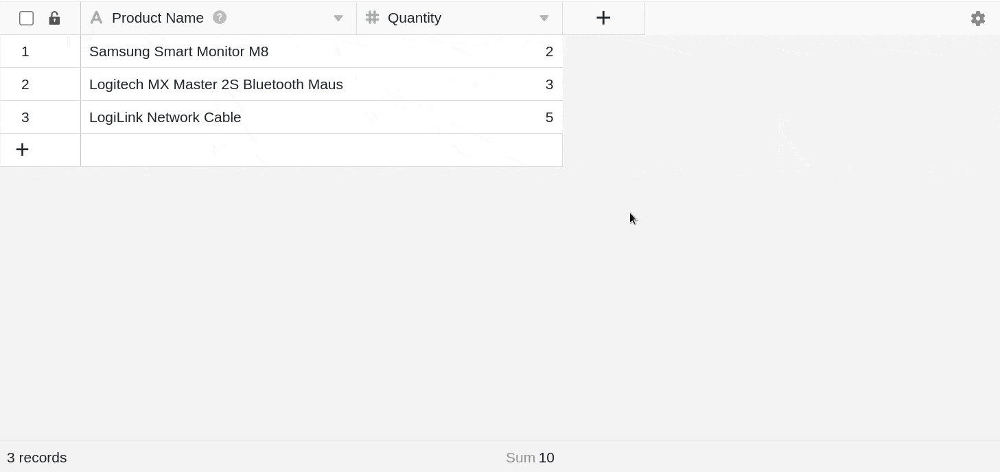

Dans SeaTable, vous pouvez utiliser la **colonne des nombres de** manière polyvalente pour travailler avec des nombres de toutes sortes (par exemple, le nombre d'objets, la distance jusqu'à des cibles, le prix d'un produit, etc.)

## Champ d'application de la colonne des nombres

L'utilisation de **colonnes de chiffres** vous permet par exemple de **calculer des valeurs** que vous pouvez visualiser à l'aide de formules et de [statistiques]().

En outre, SeaTable propose d'autres colonnes qui correspondent parfois mieux aux valeurs que vous avez indiquées.

- Durée et périodes = [colonne durée](die-dauer-spalte/)
- Date et points de temps = [colonne date](die-datum-spalte/)
- Informations géographiques = [colonne de géopositionnement](https://seatable.io/fr/docs/andere-spalten/die-geopositions-spalte/)

## Ajouter une colonne de chiffres

1. Cliquez sur le **symbole plus** à droite de la dernière colonne.
2. Donnez un **nom** à la colonne.
3. Sélectionnez **Nombre** comme type de colonne.
4. Choisissez un **format** (par ex. nombre, pourcentage ou devise).
5. En cliquant sur **Autres paramètres**, vous pouvez en outre régler des détails.
6. Ajoutez la colonne en cliquant sur **Envoyer**.

## Paramètres de format

Vous pouvez également modifier et affiner le **format des chiffres** après coup. Pour ce faire, ouvrez d'abord le menu déroulant avec les **options de colonne** en cliquant sur le triangle  dans l'en-tête de colonne et cliquez ensuite sur  **Paramètres de format**.

Vous pouvez maintenant choisir un autre **format**, régler les **séparateurs de déc** **imales** et **de milliers** et modifier le nombre de **décimales**.

### Formats disponibles pour la colonne des chiffres

Les formats de chiffres suivants sont à votre disposition :

- **Nombre**

Utilisation d'un nombre simple, par exemple pour le nombre d'objets.

- **Pourcentage**

Utilisation de pourcentages, par exemple pour la progression dans la réalisation de tâches.

- **Devises (yuan, dollar & euro)**

Utilisation de différentes devises, par exemple pour les prix des produits.

- **Devise personnalisée**

Utilisation d'une devise personnalisée, pour laquelle le symbole de la devise peut être saisi individuellement.

## Définir la valeur par défaut et valider la saisie

Vous pouvez [définir]() pour chaque colonne de chiffres, qui sera automatiquement inscrite sur chaque nouvelle ligne que vous ajoutez à votre tableau.

Pour identifier directement les **erreurs** et **les valeurs extrêmes**, vous pouvez en outre **valider** la **saisie**. Pour ce faire, vous définissez une **plage de chiffres** dans laquelle les valeurs de la colonne doivent se situer ; les cellules avec une valeur plus élevée ou plus basse sont alors mises en évidence par une couleur.

Vous pouvez effectuer ces réglages lors de la création de la colonne des nombres ou ultérieurement :

1. Ouvrez le menu déroulant avec les **options de colonne** en cliquant sur le triangle  dans l'en-tête de la colonne.
2. Cliquez ensuite sur **Personnaliser le type de colonne**.
3. Cliquez sur **Autres paramètres** et activez tout en bas les **curseurs** correspondants.

