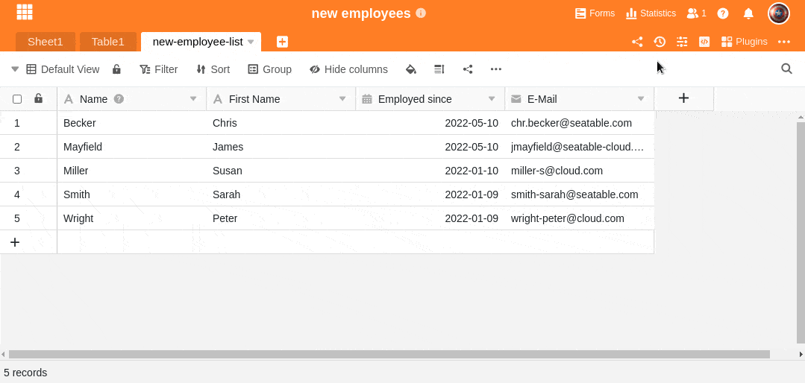

Por supuesto, puede duplicar columnas en SeaTable. Aquí puede averiguar cómo hacerlo:

1. Haga clic en el **símbolo** triangular **desplegable** situado a la derecha del nombre de una columna.
2. Seleccione **Duplicar columna**.
3. La columna **duplicada** aparece directamente a la **derecha de la** columna original.



Los valores existentes de la columna original **no** se toman. Sin embargo, puedes [copiar y pegar]() los datos de una columna a otra.


