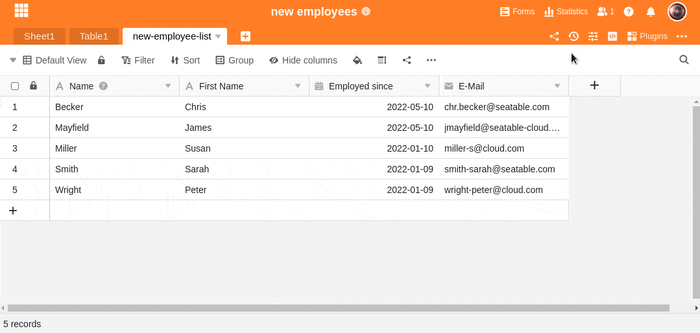

Конечно, вы можете дублировать колонки в SeaTable. Здесь вы можете узнать, как это сделать:

1. Нажмите на треугольный **символ раскрывающегося списка** справа от названия столбца.
2. Выберите **Дублировать столбец**.
3. **Дублированный** столбец появляется непосредственно **справа** от исходного столбца.



Существующие значения из исходного столбца **не** переносятся. Однако вы можете [копировать и вставлять]() данные из одного столбца в другой.


