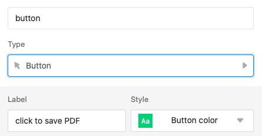
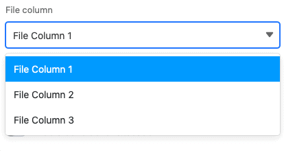
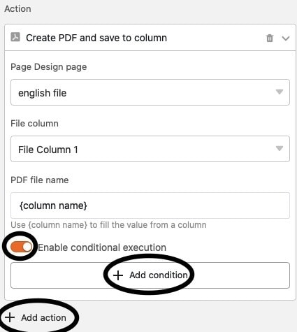
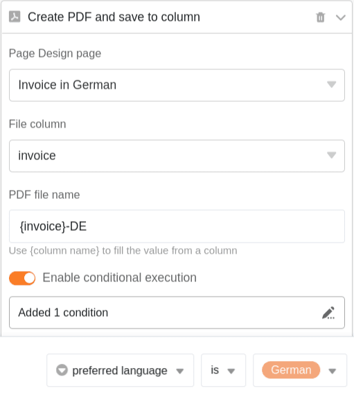
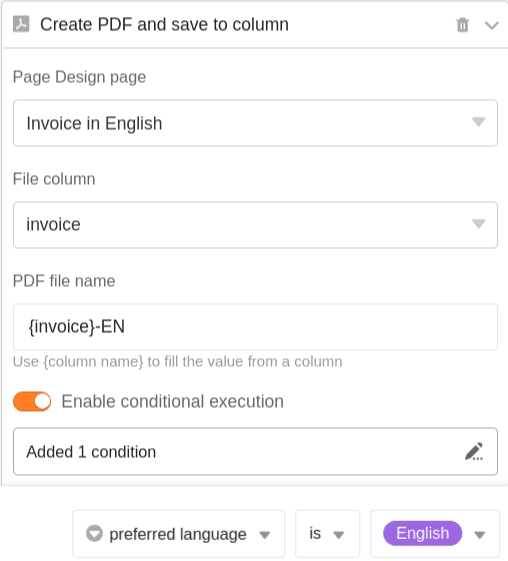

Mithilfe einer **Schaltfläche** können Sie PDF-Dokumente in Datei-Spalten speichern. Voraussetzung dafür ist die Einrichtung des **Seitendesign-Plugins** über die Base-Optionen.

## PDF-Dokumente per Schaltfläche in einer Spalte speichern

Schaltflächen ermöglichen es Ihnen, PDF-Dokumente in den [Datei-Spalten](https://seatable.io/docs/datei-und-bildanhaenge/die-datei-spalte/) Ihrer Tabellen zu speichern. Die Aktion steht Ihnen beim Erstellen einer Schaltfläche zur Verfügung, sobald Sie in der entsprechenden Tabelle das [Seitendesign-Plugin](https://seatable.io/?post_type=docs&p=19223) eingerichtet haben.

Im ersten Schritt benennen Sie die **Spalte** und legen die **Beschriftung** und **Farbe** des Buttons fest, den Sie Ihren Zeilen hinzufügen möchten.

Als Aktion legen Sie im Anschluss **"PDF-Datei in Spalte speichern"** fest.

Im Anschluss wählen Sie eine **Seite** aus dem Seitendesign-Plugin aus, die als PDF-Datei gespeichert werden soll. Sie können dabei aus bereits bestehenden Seiten wählen oder zunächst noch eine neue Seite [hinzufügen](https://seatable.io/?post_type=docs&p=19223).



Wählen Sie nun die **Datei-Spalte** aus, in welcher die Seite als PDF gespeichert werden sollen.

**Benennen** Sie abschließend die PDF-Dateien, die Ihrer Tabelle hinzugefügt werden. Verwenden Sie **{column name}**, also den Namen einer Spalte in geschwungenen Klammern, um die Datei nach dem Wert in jener Spalte zu benennen.

Nach einem Klick auf die Schaltfläche wird der entsprechenden Zeile die ausgewählte **PDF-Datei** hinzugefügt.

## Bedingte Ausführung von Schaltflächen-Aktionen

Sie haben die Möglichkeit, in einer Schaltfläche **mehrfach** die Aktion **PDF-Datei in Spalte speichern** zu definieren. Für jede einzelne Aktion können Sie dabei eine bestimmte **Bedingung** festlegen, die erfüllt sein muss, damit eine PDF-Datei bei Anklicken der Schaltfläche in der Spalte gespeichert wird. Darüber hinaus können Sie für jede Aktion eine andere **Seite** aus dem Seitendesign-Plugin zur Speicherung als PDF auswählen.

Mithilfe dieser Funktion sind Sie zum Beispiel dazu in der Lage, mit einer einzigen Schaltfläche ein Dokument in verschiedenen Sprachen zu speichern. Legen Sie mehrere Aktionen an, für die Sie jeweils eine Vorlage in unterschiedlichen **Sprachen** auswählen, und definieren Sie die Bedingung, dass je nach Sprache des Kunden die jeweils **passende Vorlage** als PDF in der Spalte gespeichert wird.

Dies wäre die Aktion zur Anlage eines deutschen Dokuments:

Und dies die Aktion zur Anlage eines englischen Dokuments:

