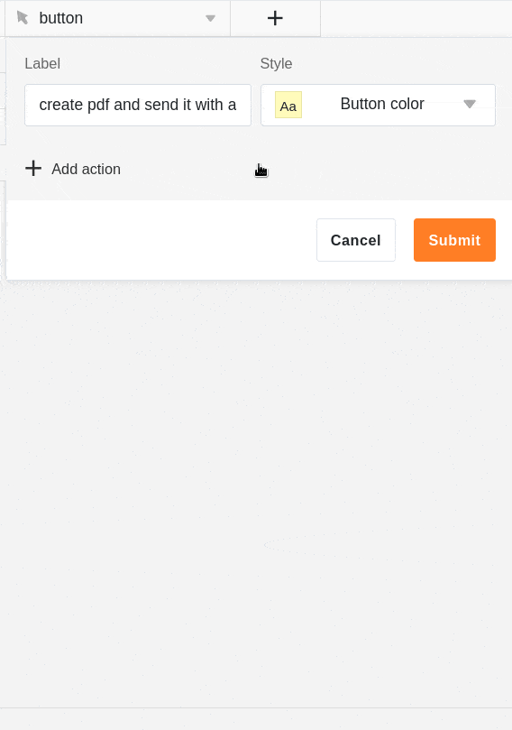

Mithilfe einer **Schaltfläche** in Ihren Zeilen können Sie E-Mails an einen oder mehrere Empfänger verschicken. Hierfür müssen Sie im Vorhinein lediglich ein **E-Mail-Konto** in SeaTable hinzugefügt haben.

## Eine E-Mail per Schaltfläche verschicken

Als Erstes wählen Sie beim Erstellen der [Schaltfläche]() die Aktion **E-Mail versenden** aus.

Wählen Sie unter **Kontoname** einen Account aus, von dem aus Sie die E-Mail versenden wollen. Falls Ihnen in diesem Feld **kein Account** angezeigt wird, müssen Sie zunächst ein [E-Mail-Konto zu SeaTable hinzufügen](https://seatable.io/docs/arbeiten-mit-bases/einrichtung-eines-e-mail-kontos-in-einer-base/).



Legen Sie nun den **Betreff** und **Inhalt** der E-Mail fest.

Wenn Sie den Regler **Formatierter Text** aktiviert haben, öffnet sich bei Doppelklick aufs Textfeld der bekannte **Editor**, in dem Sie längere Texte mit Formatierungen, Listen und Bildern verfassen können. Eine Besonderheit ist hier die Funktion, dass Sie auch **Spalten einfügen** können.

Wählen Sie den/die **Empfänger** der E-Mail aus. Sie können optional auch Empfänger auswählen, die eine **Kopie** der E-Mail erhalten sollen oder denen Sie mit der E-Mail **antworten** möchten. Mehrere Empfänger können Sie per Komma getrennt eingeben. Verwenden Sie den Namen einer Spalte in geschwungenen Klammern, um den Inhalt der Spalte zu zitieren.

Optional können Sie der E-Mail noch einen **Anhang** hinzufügen. Beachten Sie jedoch, dass Sie Dateien _nicht_ einfach hochladen können, sondern diese zunächst in einer [Datei-Spalte](https://seatable.io/docs/datei-und-bildanhaenge/die-datei-spalte/) der Tabelle speichern müssen. Im Feld **Anhänge** können Sie im Anschluss eine oder mehrere **Datei-Spalten** auswählen, aus der Sie die Dateien an die E-Mail anhängen möchten.

## Bedingte Ausführung mehrerer Schaltflächen-Aktionen

Die [Schaltfläche]() ist ein besonderer Spaltentyp, mit dem Sie **mehrere Aktionen gleichzeitig** per Knopfdruck ausführen können. Die **zeitliche Abfolge** von Aktionen können Sie durch die bedingte Ausführung einer nachfolgenden Aktion festlegen. So ist es möglich, **Aktionen hintereinanderzuschalten**.

Zum Beispiel kann es vorkommen, dass Sie mit einem Klick ein [PDF-Dokument in einer Datei-Spalte speichern](https://seatable.io/docs/andere-spalten/ein-pdf-dokument-per-schaltflaeche-in-einer-spalte-speichern/) und die Datei im Anschluss an eine E-Mail anhängen möchten. Dabei kann das Problem auftreten, dass die E-Mail schon versandt wird, bevor das PDF für den Anhang erstellt worden ist.

Um dies zu verhindern, können Sie die Ausführung von Schaltflächen-Aktionen an **Filterbedingungen** koppeln. Im genannten Anwendungsfall können Sie beispielsweise als Filterbedingung hinzufügen, dass die E-Mail **ausschließlich** versendet wird, wenn die **Datei-Spalte** in der gleichen Zeile **nicht leer** ist. So etablieren Sie eine klare Abfolge: Bei Betätigung der Schaltfläche muss SeaTable erst ein **PDF** erstellen, da die E-Mail **nur mit Anhang** verschickt werden kann.

