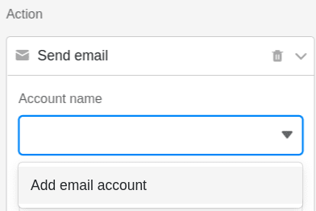
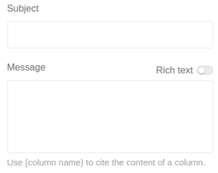
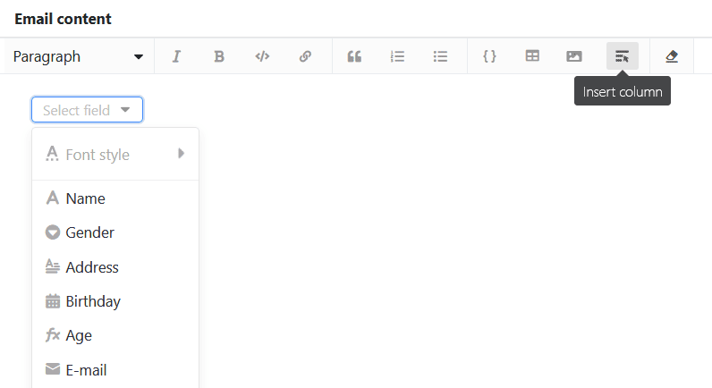

With the help of a **button** in your rows you can send e-mails to one or more recipients. All you need to do is add an **email account** in SeaTable in advance.

## Sending an e-mail with a button

First, when you create the [button](), select the **Send Email** action.

Under **Account Name**, select an account from which you want to send the email. If you **do not see an account** in this field, you must first [add](https://seatable.io/en/docs/arbeiten-mit-bases/einrichtung-eines-e-mail-kontos-in-einer-base/) an [email account to SeaTable](https://seatable.io/en/docs/arbeiten-mit-bases/einrichtung-eines-e-mail-kontos-in-einer-base/).



Now define the **subject** and **content of** the e-mail.

If you have activated the **Formatted text** slider, double-clicking on the text field opens the familiar **editor** in which you can create longer texts with formatting, lists and images. A special feature here is that you can also **insert columns**.

Select the **recipient** (s) of the email. Optionally, you can also select recipients who should receive a **copy of** the email or to whom you want to **reply** with the email. You can enter multiple recipients separated by commas. Use the name of a column in curly brackets to quote the contents of the column.

Optionally, you can add an **attachment to** the email. Note, however, that you _cannot_ simply upload files, but must first save them in a [file column of](https://seatable.io/en/docs/datei-und-bildanhaenge/die-datei-spalte/) the table. In the **Attachments** field, you can then select one or more **file columns** from which you want to attach the files to the email.

## Conditional execution of multiple button actions

The [button]() is a special type of column that allows you to perform **several actions simultaneously** by pressing a button. You can specify the **timing of** actions by conditionally executing a subsequent action. Thus it is possible to **switch actions one after the other**.

For example, you may want to [save a PDF document in a file column](https://seatable.io/en/docs/andere-spalten/ein-pdf-dokument-per-schaltflaeche-in-einer-spalte-speichern/) with one click and attach the file to an email afterwards. This may cause the problem that the email is sent before the PDF for the attachment has been created.

To prevent this, you can link the execution of button actions to **filter conditions**. In the mentioned use case, for example, you can add as a filter condition that the email will **only** be sent if the **file column** in the same row **is not empty**. This way you establish a clear sequence: When the button is pressed, SeaTable must first create a **PDF**, because the email can **only** be sent **with an attachment**.

