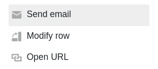
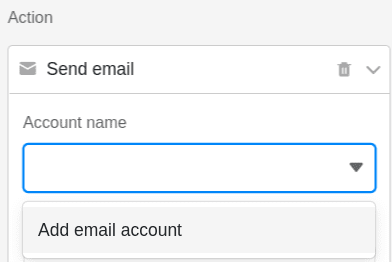
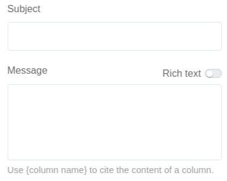
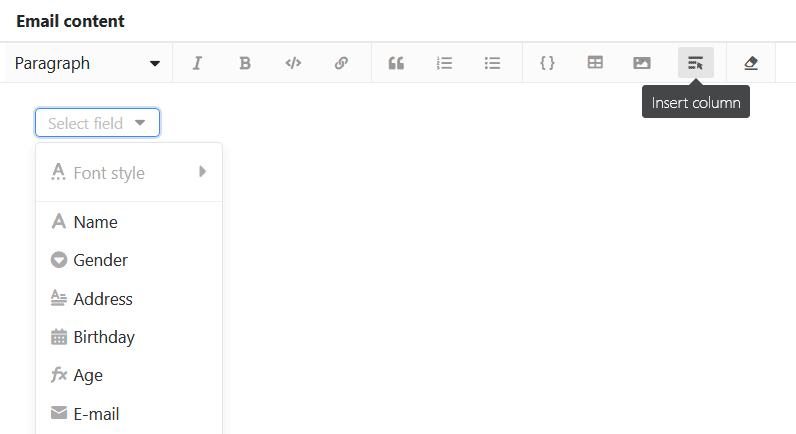
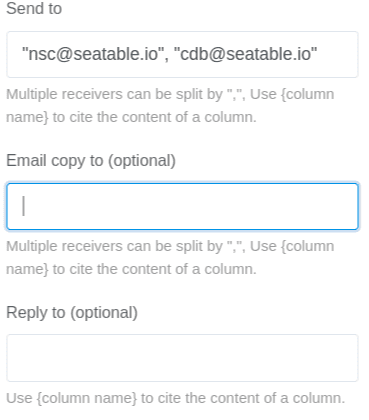
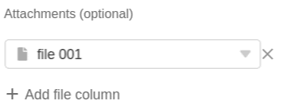
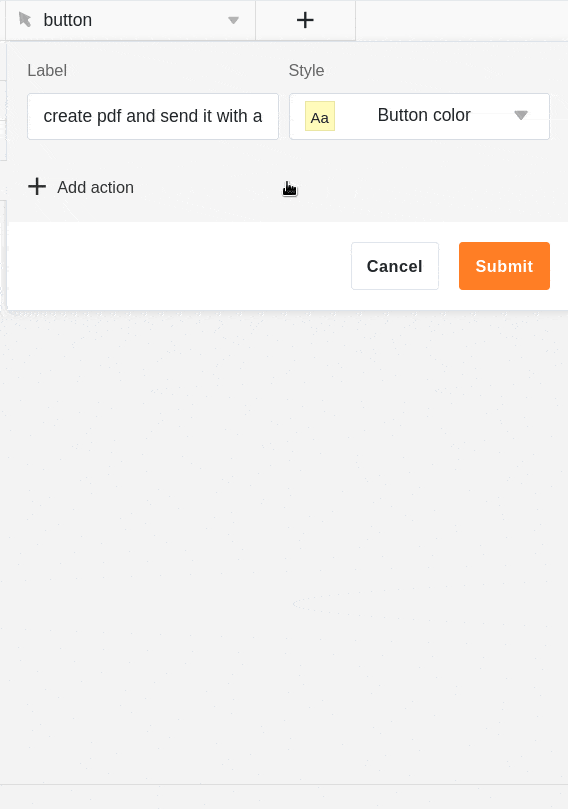

Con la ayuda de un **botón** en sus filas, puede enviar correos electrónicos a uno o varios destinatarios. Todo lo que tiene que hacer es añadir una **cuenta de correo electrónico** en SeaTable por adelantado.

## Enviar un correo electrónico mediante un botón

En primer lugar, seleccione la acción **Enviar correo electrónico** al crear el [botón]().

En **Nombre de cuenta**, seleccione la cuenta desde la que desea enviar el correo electrónico. Si **no ve una cuenta** en este campo, primero debe [añadir](https://seatable.io/es/docs/arbeiten-mit-bases/einrichtung-eines-e-mail-kontos-in-einer-base/) una [cuenta de correo electrónico a SeaTable](https://seatable.io/es/docs/arbeiten-mit-bases/einrichtung-eines-e-mail-kontos-in-einer-base/).



Defina ahora el **asunto** y el **contenido** del correo electrónico.

Si ha activado el control deslizante **Texto con formato**, al hacer doble clic en el campo de texto se abre el conocido **editor** en el que puede crear textos más largos con formato, listas e imágenes. Una característica especial es que también puede **insertar columnas**.

Seleccione el **destinatario** o **destinatarios** del correo electrónico. Opcionalmente, también puede seleccionar destinatarios que deban recibir una **copia** del correo electrónico o a los que desee **responder** con el mismo. Puede introducir varios destinatarios separados por comas. Utilice el nombre de una columna entre llaves para citar el contenido de la columna.

Opcionalmente, puede añadir un **archivo adjunto** al correo electrónico. Tenga en cuenta, sin embargo, que _no puede_ simplemente cargar archivos, sino que primero debe guardarlos en una columna de archivos [de](https://seatable.io/es/docs/datei-und-bildanhaenge/die-datei-spalte/) la tabla. A continuación, en el campo **Archivos adjuntos**, puede seleccionar una o varias **columnas** de archivos desde las que desee adjuntar los archivos al correo electrónico.

## Ejecución condicional de acciones de varios botones

El [botón]() es un tipo de columna especial con el que puede ejecutar **varias acciones simultáneamente** pulsando un botón. Puede determinar la **secuencia cronológica de las** acciones ejecutando condicionalmente una acción posterior. Esto permite **alternar acciones una tras** otra.

Por ejemplo, es posible que desee [guardar un documento PDF en una columna de archivos](https://seatable.io/es/docs/andere-spalten/ein-pdf-dokument-per-schaltflaeche-in-einer-spalte-speichern/) con un solo clic y adjuntar el archivo a un correo electrónico. El problema puede surgir que el correo electrónico se envíe antes de que se haya creado el PDF para el archivo adjunto.

Para evitarlo, puede vincular la ejecución de las acciones de los botones a condiciones de **filtro**. En el caso de uso mencionado, por ejemplo, puede añadir como condición de filtro que el correo electrónico **sólo** se envíe si la **columna de archivo** de la misma fila **no** está **vacía.** De este modo, establece una secuencia clara: cuando se pulsa el botón, SeaTable debe crear primero un **PDF** porque el correo electrónico **sólo** puede enviarse **con un archivo adjunto**.

