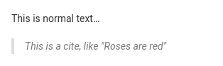

[Markdown](https://en.wikipedia.org/wiki/Markdown) est un langage de balisage très simplifié utilisé pour **mettre en forme des textes**. SeaTable utilise Markdown à différents endroits pour mettre en forme des textes longs de manière visuellement attrayante.

Vous n'êtes pas obligé de vous familiariser avec la syntaxe de Markdown. Mais que vous utilisiez Markdown pour la première fois ou que vous ayez déjà de l'expérience, cet article vous aidera à mieux comprendre où et comment utiliser la version SeaTable de Markdown.

## SeaTable Markdown

Actuellement, il existe cinq domaines dans lesquels vous pouvez utiliser la syntaxe Markdown dans SeaTable. Il s'agit de :

- Colonnes de type [Texte formaté](https://seatable.io/fr/docs/text-und-zahlen/die-spalten-text-und-formatierter-text/)
- [Descriptions de la base](https://seatable.io/fr/docs/arbeiten-mit-bases/wie-man-einer-base-eine-beschreibung-hinzufuegt/)
- Textes d'e-mails lors de l'envoi via [des automatisations](https://seatable.io/fr/docs/beispiel-automationen/e-mail-versand-per-automation/) et [des boutons](https://seatable.io/fr/docs/andere-spalten/eine-e-mail-per-schaltflaeche-verschicken/)
- [Formulaires web]()
- [Apps universelles](https://seatable.io/fr/docs/apps/universelle-app/)

Dès que Markdown est utilisé dans SeaTable, le masque de saisie suivant vous est proposé. Vous pouvez bien sûr sélectionner des mots ou des blocs de texte comme d'habitude, puis choisir la mise en forme souhaitée.


Vous pouvez également déclencher directement le formatage Markdown en saisissant certains caractères spéciaux. Il suffit de taper dans un champ de saisie Markdown un  suivi d'un mot. Vous verrez que dans la syntaxe Markdown, le dièse correspond à un premier titre. Ainsi, si vous savez quel caractère spécial déclenche quel formatage, vous pouvez saisir et formater vos textes beaucoup plus rapidement.

Actuellement, vous ne pouvez déclencher qu'une partie du formatage par un caractère spécial. Vous découvrirez dans cet article quels sont ces caractères.



## Déclencher le formatage syntaxique dans SeaTable par des caractères spéciaux

Actuellement, SeaTable permet d'activer les options de syntaxe suivantes par des caractères spéciaux.

### Titres

Une ligne commençant par un à trois \-suivi d'un espace, donne un **Titre** du premier au troisième niveau.

**Syntaxe Markdown**

\# En-tête de premier niveau  
\## Second level header  
\### En-tête de troisième niveau

**Résultat**


### Gras et italique

Texte rédigé par un  ou  couple est entouré **en italique** formaté (ce qui, en Markdown, signifie une emphase) ; le texte qui est accompagné d'un double  ou  couple est entouré **gras** (ce qui signifie une forte accentuation en Markdown). Les mises en forme peuvent également être combinées avec d'autres formats en ligne.

**Syntaxe Markdown**

\*Ce texte sera en italique\*  
\_Ce sera aussi en italique

\*\*This text will be bold\*\*.  
\_\_This will also be bold\_\_

\_\*\*Combine them for bold italic\*\*\_

**Résultat**

_Ce texte sera en italique_  
_Ce sera aussi en italique_

**Ce texte sera en gras**  
**Ce texte sera également en gras**

_**Combinez-les pour obtenir un italique gras**_

### Liste non triée

Vous pouvez soit  ou  comme marqueur d'une **liste non triée** utiliser.


### Liste triée

Si une ligne commence par un elle est automatiquement transformée en une **liste triée** transformé.

1\. item 1  
2ème item 2

### Citations en bloc

Un **Citation en bloc** est une ligne qui commence par  suivie du contenu de la citation. Les citations sont signalées par une indentation et un cadre dans la marge de gauche.



### Code en ligne

Texte rédigé par un  couple est représenté sous forme de code en ligne. Ainsi, de **apiKey est votre jeton secret API** le formatage suivant :


### Blocs de code

Un **Bloc de code** est déterminé par trois successives **Bâtons de cuisson**  a été introduit. La particularité du bloc de code est que son contenu est présenté sous forme de **Code en ligne** est affiché avec une police monospace. Les indentations sont également conservées telles qu'elles sont saisies.


### Sauts de ligne

Chaque retour à la ligne  est traité comme un saut de ligne dur avec un espace entre les deux lignes. Un saut de ligne sans espace entre les différentes lignes n'est pas possible. Aussi **plusieurs retours à la ligne** à la suite sont supprimés et réduits à un simple retour à la ligne.

## Formatages que vous ne pouvez pas activer par des caractères spéciaux

**Cases à cocher** sont typiquement remplacés en Markdown par un  ou un  est saisie. Toutefois, cette saisie n'est pas automatiquement convertie en case à cocher. Au lieu de cela, vous devez utiliser la petite icône de case à cocher  cliquer.

**Les hyperliens** sont également pris en charge dans SeaTable Markdown, mais ne peuvent être insérés que via l'icône .

## Formats non pris en charge

 n'est pas pris en charge par SeaTable. Les doubles retours à la ligne sont également supprimés et un  n'est pas interprété comme un saut de ligne supplémentaire.
