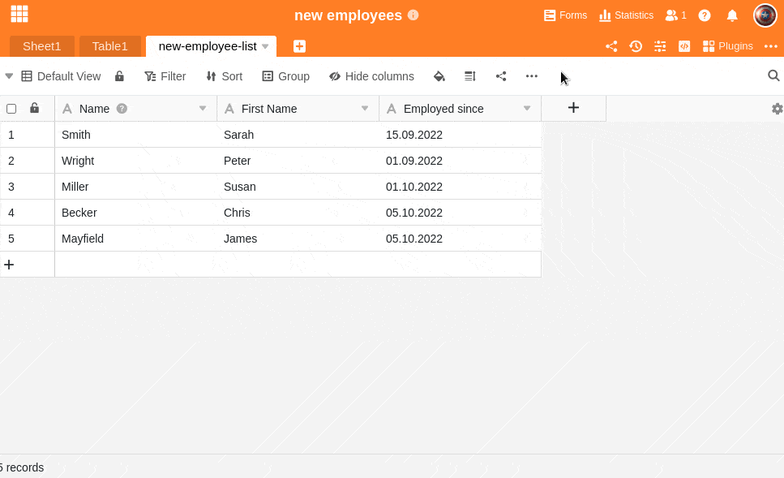

Tabellen bestehen in SeaTable aus Spalten und Zeilen. Innerhalb einer Base können Sie einer Tabelle bis zu 500 Spalten hinzufügen. Für jede Spalte haben Sie individuell die Möglichkeit, je nach Datentyp einen geeigneten **Spaltentyp** auszuwählen.

Eine detaillierte Übersicht über alle derzeit in SeaTable verfügbaren Spaltentypen finden Sie [hier]().

## Spalte hinzufügen

1. Klicken Sie rechts neben der letzten Spalte Ihrer Tabelle auf das **\[+\]-Symbol**.
2. Im oberen Feld **benennen** Sie die Spalte, die Sie hinzufügen möchten.
3. Im unteren Feld weisen Sie der Spalte aus dem **Drop-down-Menü** einen passenden **Spaltentyp** zu.
4. Bei einem Großteil der Spaltentypen müssen Sie zudem noch weitere **spezifische Einstellungen** für die Spalte vornehmen.
5. Bestätigen Sie den Vorgang durch einen Klick auf **Abschicken**.


