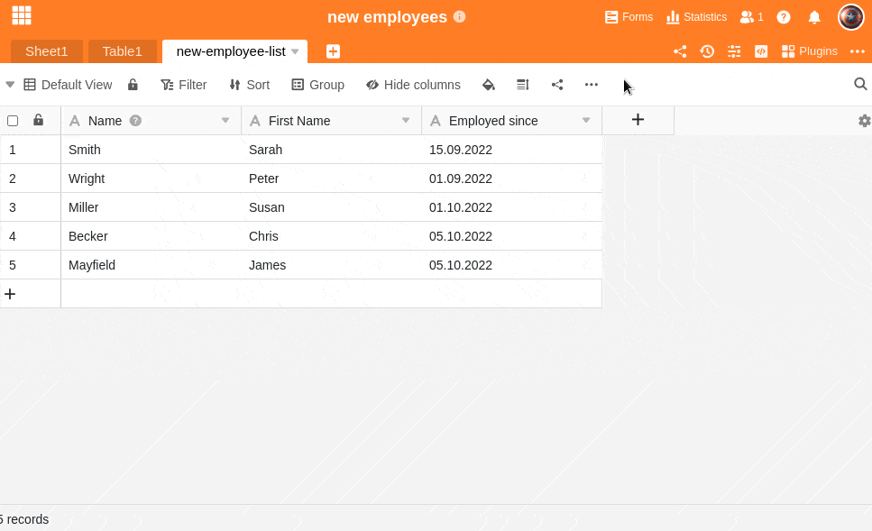

Tables in SeaTable consist of columns and rows. Within a base you can add up to 500 columns to a table. For each column you have individually the possibility to select a suitable **column type** depending on the data type.

A detailed overview of all column types currently available in SeaTable can be found [here](https://seatable.io/en/docs/spalten/uebersicht-alle-spaltentypen/).

## Add column

1. Click the **\[+\] symbol** to the right of the last column in your table.
2. In the upper field, **name the** column you want to add.
3. In the lower field, assign a suitable **column type** to the column from the **drop-down menu**.
4. For a large part of the column types, you also need to make other **specific settings** for the column.
5. Confirm the process by clicking **Submit**.
   
