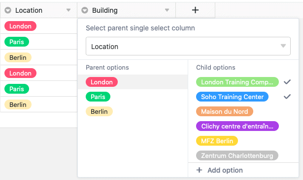
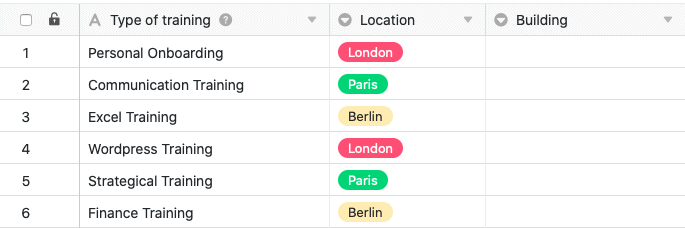

Mit den Einfachauswahl-Optionen gibt Ihnen SeaTable ein wichtiges Instrument an die Hand, um Ihre Daten zu ordnen und Tabellen übersichtlich zu gestalten. Bei der Verwendung von Spalten dieses Typs können Sie zudem eine Kaskadierung definieren.

Mithilfe der Kaskadierungsfunktion können Sie für jede Einfachauswahl-Spalte eine übergeordnete Spalte desselben Typs festlegen, welche die zur Verfügung stehenden Optionen der untergeordneten Einfachauswahl-Spalte einschränkt.

## Kaskadierung einer Einfachauswahl

1. Klicken Sie auf das **Dreieck-Symbol** einer beliebigen Einfachauswahl-Spalte.
2. Klicken Sie auf **Kaskadierung definieren**.
3. Wählen Sie eine beliebige **Einfachauswahl-Spalte** aus, die als übergeordnete Spalte fungieren soll.
4. Weisen Sie den **übergeordneten Optionen** dieser Spalte beliebige Optionen aus der **aktuellen, zu Beginn ausgewählten Spalte** zu.

## Funktionsweise einer Kaskadierung



Wenn Sie eine Kaskadierung für eine Einfachauswahl-Spalte definieren, **schränken Sie die Optionen ein**, welche den Zellen in dieser Spalte zugewiesen werden können. Als entscheidender Faktor fungieren dabei die Optionen der Einfachauswahl-Spalte, die Sie als **übergeordnete Spalte** definieren. Für ein besseres Verständnis wird die Funktionsweise einer Kaskadierung anhand eines **Beispiels** ausführlich erläutert:

In diesem Beispiel enthält die Tabelle Daten über verschiedene Fortbildungs-/Trainingseinheiten von Mitarbeitern. Neben der ersten Spalte, die verschiedene Trainings erfasst, existiert bereits eine **Einfachauswahl-Spalte**, die den jeweiligen Standort des Trainings angibt. Für eine **neu hinzugefügte Einfachauswahl-Spalte**, welche das genaue Gebäude erfasst, wird in diesem Beispiel eine **Kaskadierung** definiert.

Als **übergeordnete** Einfachauswahl-Spalte dient in diesem Beispiel die Spalte **"Location"**, welche die Stadt angibt, in der das jeweilige Training stattfindet. Im nächsten Schritt weist man nun den drei Städten in dieser Spalte **untergeordnete Optionen** aus der neu angelegten Einfachauswahl-Spalte **"Building"** zu.

Konkret werden den drei Orten **London**, **Paris** und **Berlin** die Gebäude zugewiesen, die sich in der jeweiligen Stadt befinden.

Indem man eine solche Kaskadierung definiert, **begrenzt** man letztlich **die Optionen in der untergeordneten Spalte**. Welche Optionen bzw. Gebäude in einer Zelle der untergeordneten Spalte "Building" verfügbar sind, hängt dabei von der Stadt ab, welche in derselben Zeile bei der Einfachauswahl-Spalte "Location" ausgewählt ist. Dadurch stehen in jeder Zelle der Spalte "Building" **ausschließlich** die Gebäude zur Auswahl, die sich auch in der entsprechenden Stadt befinden.

## Vorteile

- Mithilfe einer Kaskadierung kann die Anzahl an **Optionen**, die in einer Einfachauswahl-Spalte zur Auswahl stehen, **reduziert** werden. Besonders in Einfachauswahl-Spalten mit einer besonders großen Anzahl an verfügbaren Optionen, kann diese Funktion sehr hilfreich sein, um potenzielle Fehler beim Einpflegen von Daten zu **minimieren**.
- Darüber hinaus können Kaskadierungen von Einfachauswahl-Spalten auch dabei helfen, **Arbeitsprozesse zu beschleunigen**, da durch die reduzierte Anzahl an zur Auswahl stehenden Optionen zugleich die **Komplexität reduziert** wird.
