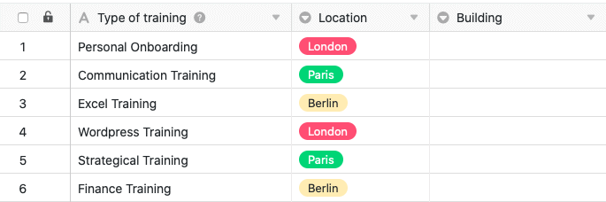

With the single selection options, SeaTable gives you an important tool to organize your data and make tables clear. When using columns of this type, you can also define cascading.

Using the cascading feature, you can specify a parent column of the same type for each single-selection column, which limits the available options of the child single-selection column.

## Cascading a single selection

1. Click the **triangle icon of** any single-selection column.
2. Click **Define cascading**.
3. Select any **single-selection column** to act as the parent column.
4. Assign any options from the **current** column **selected at the beginning to** the **parent** options of this **column**.

## Functionality of a cascading



When you define cascading for a single-selection column, **you restrict the options** that can be assigned to the cells in that column. The decisive factor here is the options of the single-selection column that you define as the **parent column**. For a better understanding, the functionality of a cascading is explained in detail by means of an **example:**

In this example, the table contains data about various employee education/training sessions. In addition to the first column that captures different trainings, a **single-selection column** already exists that specifies the particular location of the training. For a **newly added single selection column** that captures the exact building, **cascading** is defined in this example.

In this example, the **"Location"** column, which indicates the city in which the respective training takes place, serves as the **superordinate** single-selection column. In the next step, the three cities in this column are assigned **subordinate options** from the newly created single-selection column **"Building"**.

Specifically, the three locations of **London**, **Paris**, and **Berlin** are assigned the buildings that are located in each city.

By defining such a cascade, you ultimately **limit** **the options in the child column**. Which options or buildings are available in a cell of the subordinate column "Building" depends on the city, which is selected in the same row for the single selection column "Location". This means that in each cell of the "Building" column, **only** those buildings are available for selection that are also located in the corresponding city.

## Advantages

- Cascading can be used to **reduce the** number of **options** available in a single-selection column. Especially in single-selection columns with a particularly large number of available options, this function can be very helpful in **minimizing** potential errors when entering data.
- In addition, cascading single-selection columns can also help **speed up work processes**, as the reduced number of options available for selection also **reduces complexity**.
