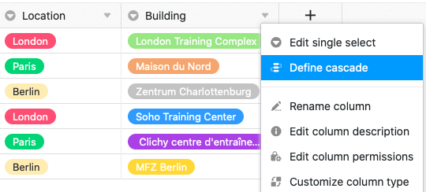

Благодаря опциям одиночного выбора SeaTable предоставляет вам важный инструмент для организации данных и наглядного представления таблиц. При использовании столбцов этого типа можно также задать каскадирование.

Используя функцию каскадирования, вы можете определить родительский столбец того же типа для каждого столбца одиночного выбора, который ограничивает доступные опции дочернего столбца одиночного выбора.

## Каскадирование одного выбора

1. Нажмите на **символ треугольника** любого столбца с одиночным выбором.
2. Нажмите кнопку **Определить каскадирование**.
3. Выберите любой **столбец с одиночным выбором** в качестве родительского столбца.
4. Присвоить любые опции из **текущего** столбца, **выбранного в начале**, **родительским** опциям этого **столбца**.

## Как работает каскадирование



Когда вы определяете каскадирование для столбца с одним выбором, **вы ограничиваете параметры**, которые могут быть назначены ячейкам этого столбца. Опции колонки одиночного выбора, которую вы определяете в качестве **родительской** колонки, выступают в качестве решающего фактора. Для лучшего понимания функционирование каскада подробно объясняется на **примере**:

В данном примере таблица содержит данные о различных занятиях по развитию/обучению персонала. В дополнение к первому столбцу, в котором фиксируются различные тренинги, уже существует **столбец с одним выбором**, в котором указывается соответствующее место проведения тренинга. Для **вновь добавленной колонки выбора**, в которой записывается точное здание, в данном примере определено **каскадирование**.

В данном примере столбец **"Местонахождение"** выступает в качестве **вышестоящего** столбца одиночного выбора, в котором указывается город, в котором проводится соответствующее обучение. На следующем шаге трем городам из этого столбца присваиваются **подчиненные варианты** из вновь созданного столбца одиночного выбора **"Здание"**.

В частности, трем локациям **Лондон**, **Париж** и **Берлин** присваиваются здания, расположенные в соответствующем городе.

Определяя такой каскад, можно в конечном итоге **ограничить** **варианты в подчиненном столбце**. Варианты или здания, доступные в ячейке подчиненного столбца "Здание", зависят от города, выбранного в той же строке в столбце одиночного выбора "Местоположение". Это означает, что в каждой ячейке столбца "Здание" доступны для выбора **только** те здания, которые также расположены в соответствующем городе.

## Преимущества

- Каскадирование можно использовать для **уменьшения** количества **вариантов**, доступных в колонке с одним выбором. Особенно в колонках с одним выбором и особенно большим количеством доступных вариантов эта функция может быть очень полезна для **минимизации** возможных ошибок при вводе данных.
- Кроме того, каскадные колонки с одним выбором также могут помочь **ускорить рабочие процессы**, поскольку уменьшение количества вариантов для выбора также **снижает сложность**.
