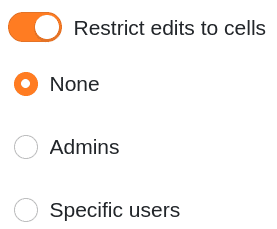
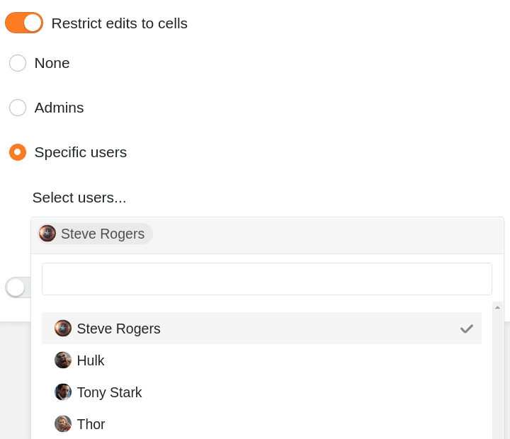



Se tiver direitos de proprietário ou administrador, pode definir em cada coluna da tabela **quem está autorizado a editar células e definições da respectiva coluna**. Tem três opções diferentes em cada caso.



## Definir permissões de coluna

1. Clique no **ícone drop-down**  no cabeçalho de qualquer coluna.
2. Clique em **Edit Column Permissions (Editar permissões de coluna**).
3. Defina o desejado **Autorizações** fixo. Para cada coluna pode **dois** estabelecer permissões diferentes:
    - Autorização para editar as células desta coluna
    - Autorização para editar as definições das colunas
4. As configurações efectuadas são **guardadas automaticamente**.

## Autorização para editar as células

Com a ajuda desta permissão, pode restringir quem pode **editar** as **células** da coluna seleccionada. Pode escolher entre **três** opções:

- **Opção 1**: Ninguém pode editar as células da coluna seleccionada.

Se seleccionar esta opção, **nenhum utilizador**, independentemente da sua função, poderá editar as células da coluna até que a permissão correspondente seja revogada pelo _proprietário do grupo_ ou por um _administrador do grupo_.

A **todos os utilizadores** é mostrado um **símbolo de bloqueio** correspondente ao lado do nome da coluna , juntamente com uma nota.

- **Opção 2**: Os administradores podem editar as células da coluna seleccionada.

Se seleccionar esta opção, apenas os **proprietários** e **administradores** podem editar as células da coluna.

**Os membros do grupo**, por outro lado, **não podem** editar as células e é-lhes mostrado o **símbolo do cadeado**  juntamente com uma nota ao lado do nome da coluna.

- **Opção 3**: Os utilizadores específicos podem editar as células da coluna seleccionada.

Com esta opção, pode **seleccionar os membros do grupo** que devem ter a permissão para editar as células da coluna.

Os membros do grupo que **não** são seleccionados por si, por outro lado, **não podem** editar as células e é-lhes mostrado o **símbolo do cadeado**  juntamente com uma nota ao lado do nome da coluna.

## Autorização para editar as definições das colunas

Esta permissão permite-lhe restringir quem pode **alterar** as **definições** da coluna seleccionada.

As seguintes configurações são afectadas:

- Renomear coluna
- Editar descrição da coluna
- Adaptar o tipo de coluna
- Formatar células da coluna

Pode escolher entre **três** opções na atribuição de permissões:

- **Opção 1**: Ninguém pode editar as definições da coluna seleccionada.
- **Opção 2**: Os administradores podem editar as definições da coluna seleccionada.
- **Opção 3**: Os utilizadores específicos podem editar as definições da coluna seleccionada.

As opções individuais têm basicamente o **mesmo efeito** que com as permissões de edição das células acima descritas. **Os utilizadores sem a autorização correspondente** **não podem** editar as definições da coluna seleccionada até que o bloqueio seja removido.

As **definições da coluna** bloqueada estão a **cinzento** para estes utilizadores. Quando movem o ponteiro do rato sobre as definições, uma **nota** indica também a falta de autorização.

