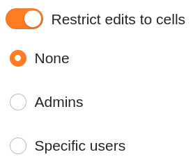
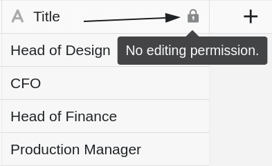
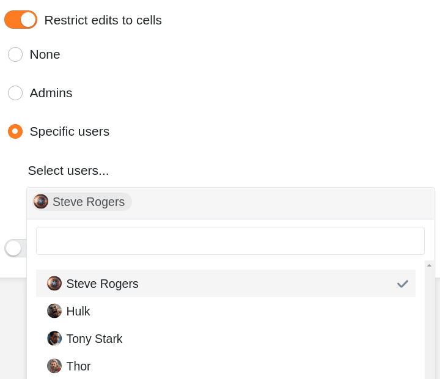
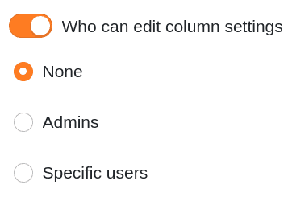
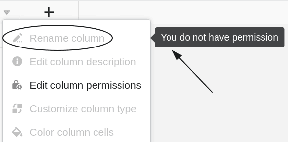



Если у вас есть права владельца или администратора, вы можете определить в каждом столбце таблицы **, кто имеет право редактировать ячейки и настройки соответствующего столбца**. В каждом случае у вас есть три варианта.



## Установите разрешения для столбцов

1. Нажмите на **значок выпадающего** списка  в заголовке любого столбца.
2. Нажмите кнопку **Редактировать разрешения столбцов**.
3. Установите нужный **Разрешения** фиксированный. Для каждого столбца вы можете **два** установить различные разрешения:
    - Разрешение на редактирование ячеек в этом столбце
    - Разрешение на редактирование настроек колонки
4. Сделанные настройки **сохраняются автоматически**.

## Разрешение на редактирование ячеек

С помощью этого разрешения вы можете ограничить, кто может **редактировать** **ячейки** выбранного столбца. Вы можете выбрать один из **трех** вариантов:

- **Вариант 1**: Никто не может редактировать ячейки выбранного столбца.

Если вы выберите эту опцию, **ни один пользователь**, независимо от его роли, **не** сможет редактировать ячейки в столбце, пока соответствующее разрешение не будет отозвано _владельцем группы_ или _администратором группы_.

Для **всех пользователей** рядом с именем столбца  отображается соответствующий **символ замка** вместе с примечанием.

- **Вариант 2**: Администраторы могут редактировать ячейки выбранного столбца.

Если вы выберите этот параметр, только **владельцы** и **администраторы** смогут редактировать ячейки в столбце.

**Члены группы**, с другой стороны, **не могут** редактировать ячейки и отображают **символ замка**  вместе с примечанием рядом с именем столбца.

- **Вариант 3**: Определенные пользователи могут редактировать ячейки выбранного столбца.

С помощью этого параметра можно **выбрать членов группы**, которые должны иметь право редактировать ячейки столбца.

Члены группы, **не** выбранные вами, напротив, **не могут** редактировать ячейки и отображают **символ замка**  вместе с примечанием рядом с именем столбца.

## Разрешение на редактирование настроек колонки

Это разрешение позволяет ограничить круг лиц, которые могут **изменять** **настройки** выбранного столбца.

При этом затрагиваются следующие настройки:

- Переименовать колонку
- Редактировать описание столбца
- Адаптировать тип колонки
- Форматирование ячеек столбца

При назначении разрешений можно выбрать один из **трех** вариантов:

- **Вариант 1**: Никто не может редактировать настройки выбранной колонки.
- **Вариант 2**: Администраторы могут редактировать настройки выбранной колонки.
- **Вариант 3**: Определенные пользователи могут редактировать настройки выбранной колонки.

Отдельные опции в основном имеют тот **же эффект**, что и разрешения на редактирование ячеек, описанные выше. **Пользователи без соответствующих полномочий** **не могут** редактировать настройки выбранного столбца до тех пор, пока блокировка не будет снята.

Для таких пользователей **настройки** заблокированных **столбцов** выделены **серым** цветом. Когда они наводят указатель мыши на настройки, **примечание** также указывает на отсутствие полномочий.

